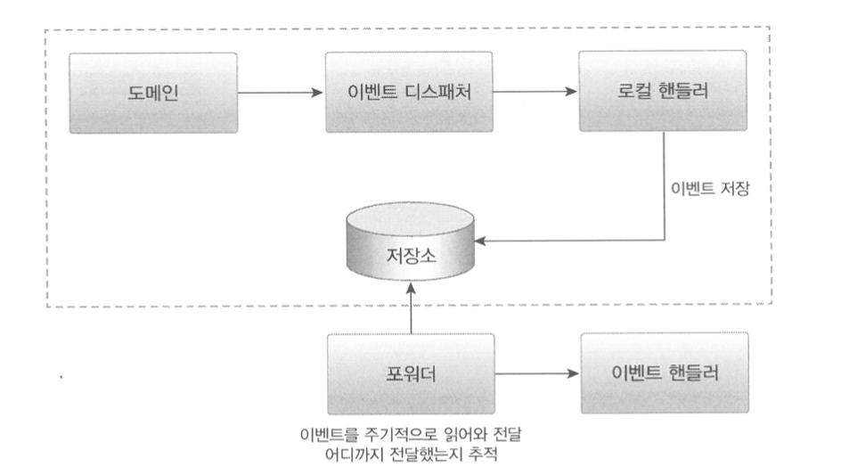
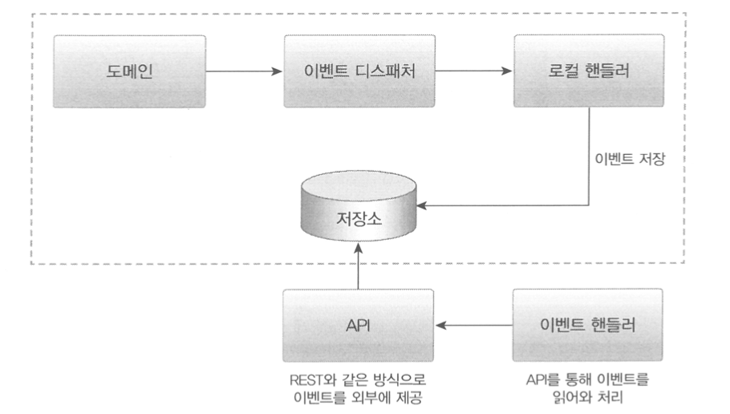
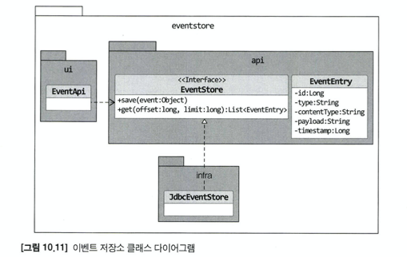

# 10.4 동기 에벤트 처리 문제

이벤트를 사용해서 강결합 문제는 해소했지만 아직 남아있는 문제가 있다. 외부 서비스에 영향을 받는 문제이다. 

```java
// 응용 서비스 코드
@Transactional
public void cancel(OrderNo orderNo) {
  Order order = findOrder(orderNo);
  order.cancel(); //order.cancel()에서 OrderCancelEvent 발생
}

// 이벤트를 처리하는 코드
@Service
public class OrdercaneledEventHandler {
  @EventListener(OrderCanceledEvent.class) {
    public void handle(OrderCanceledEvent event) {
      // refundService.refund()가 느려지거나 익셉션이 발생하면?
      refundService.refund(event.getOrderNumber());
    }
  }
}
```

위의 코드에서 refundSErvice.refund()가 외부 환불 서비스와 연동한다고 할떄, 외부 환불 기능이 느려지면 cancel() 메서드도 함께 느려진다. 이것은 외부 서비스의 성능 저하가 바로 시스템 내 성능 저하로 연결된다는 것을 의미한다. 성능 저하 뿐만 아니라 트랜잭션도 문제가 있다. refundService.refund()에서 익셉션이 발생하면 cancel() 메서드의 트랜잭션을 롤백해야 할까? 트랜잭션을 롤백하면 구매 취소 기능을 롤백하는 것이므로 구매 취소가 실패하는 것과 같다.

생각해 볼 만한 것은 외부 환불 서비스 실행에 실패했다고 해서 반드시 트랜잭션을 롤백해야 하는지에 대한 문제다. 일단 구매 취소 자체는 처리하고 환불만 재처리하거나 수동으로 처리할 수도 있다. 

외부 시스템과의 연동을 동기로 처리할 때 발생하는 성능과 트랜잭션 범위 문제를 해소하는 방법은 이벤트를 비동기로 처리하거나 이벤트와 트랜잭션을 연계하는 것이다. 두 방법 중 비동기 이벤트 처리에 대해 알아보자.

# 10.5 비동기 이벤트 처리

회원가입 신청을 하면 검증을 위해 이메일을 보내는 서비스가 많다. 회원 가입 신청을 하자마자 바로 내 메일함에 검증 이메일이 도착할 필요는 없다. 이메일이 20초 뒤에 도착해도 되고, 이메일을 받지 못하면 다시 받을 수 있는 기능을 이용하면 된다.

비슷하게 주문을 취소하자마자 바로 결제를 취소하지 않아도 된다. 수십 초 내에 결제 취소가 이루어지며 된다. 며칠 뒤에 결제가 확실하게 취소되면 문제 없을 때도 있다.

이렇게 우리가 구현해야 할 것 중에서 'A하면 B하라'는 내용의 요구사항은 실제로 'A하면 최대 언제까지 B하라' 또는 'A하면 최대 언제까지 B하고 실패할 경우, 재시도할 수 있게 하라'인 경우가 많다. 즉, 일정 시간 안에만 후속 조치를 처리하면 되는 경우가 적지 않다. 

A하면 B하라는 요구사항에서 A하면은 이벤트로 볼 수 있다. B하라는 것은 이벤트 핸들러에 해당한다. 다시 말해서 A 이벤트가 발생하면 별도 스레드로 B를 수행하는 핸들러를 실행하는 방식으로 요구사항을 구현할 수 있다. 이벤트를 비동기로 구현할 수 있는 4가지 방법을 살펴보자.

- 로컬 핸들러로 비동기 실행하기
- 메시지 큐 사용하기
- 이벤트 저장소와 이벤트 포워더 사용하기
- 이벤트 저장소와 이벤트 제공 API 사용하기

## 로컬 이벤트 핸들러 비동기 실행

이벤트 핸들러를 비동기로 실행하는 방법은 이벤트 핸들러를 별도 스레드로 실행하는 것이다. 스프링이 제공하는 @Async 애너테이션을 사용하면 손쉽게 비동기로 이벤트 핸들러를 실행할 수 있다. 이를 위해 다음 두 가지만 하면 된다.

- @EnableAsync 애너테이션을 사용해서 비동기 기능을 활성화한다.
- 이벤트 핸들러 메서드에 @Async 애너테이션을 붙인다.

```java
@SpringBootApplication
@EnableAsync
public class ShopApplication {
  public static void main(String[] args) {
    SpringApplication.run(ShopApplication.class, args);
  }
}

import org.spirngframework.scheduling.annotation.Async;

@Service
public class OrderCanceledEventHandler {
  @Async
  @EventListener(OrderCanceledEvent.class) 
  public void handle(OrderCanceledEvent event) {
    refundService.refund(event.getOrderNumber());
  }
}
```

@EnableAsync 애너테이션은 스프링의 비동기 실행 기능을 활성화한다. 스프링 설정 클래스에 @EnableAsync 애너테이션을 붙이면 된다. 비동기로 실행한 이벤트 핸들러 메서드에 @Async 애너테이션만 붙이면 된다. 스프링은 OrderCanceledEvent가 발생하면 handle() 메서드를 별도 스레드를 이용해서 비동기로 실행한다.

## 메시징 시스템을 이용한 비동기 구현

비동기로 이벤트를 처리해야할 때 사용하는 또 다른 방법은 카프카나 래빗과 같은 메시징 시스템을 사용하는 것이다. 이벤트가 발생하면 이벤트 디스패치는 이벤트를 메시지 큐에 보낸다. 메시지 큐는 이벤트르 ㄹ메시지 리스너에 전달하고, 메시지 리스너는 알맞은 이벤트 핸들러를 이용해서 이벤트를 처리한다. 이때 이벤트를 메시지 큐에 저장하는 과정과 메시지 큐에서 이벤트를 읽어와 처리하는 과정은 별도 스레드나 프로세스로 처리된다.

필요하다면 이벤트를 발생시키는 도메인 기능과 메시지 큐에 이벤트를 저장하는 절차를 한 트랜잭션으로 묶어야 한다. 도메인 기능을 실행한 결과를 DB에 반영하고 이 과정에서 발생한 이벤트를 메시지 큐에 젖아하는 것을 같은 트랜잭션 범위에서 실행하려면 글로벌 트랜잭션이 필요하다.

글로벌 트랜잭션을 사용하면 안전하게 이벤트를 메시지 큐에 전달할 수 있는 장점이 있지만 반대르 글로벌 트랜잭션으로 인해 전체 성능이 떨어지는 단점도 있다. 글로벌 트랜잭션을 지원하지 않는 메시징 시스템도 있다.

메시지 큐를 사용하면 보통 이벤트를 발생시키는 주체와 이벤트 핸들러가 별도 프로세스에서 동작한다. 이것은 이벤트 발생 JVM과 이벤트 처리 JVM이 다르다는 것을 의미한다. 물론 한 JVM에서 이벤트 발생 주체와 이벤트 핸들러가 메시지 큐를 이용해서 이벤트를 주고받을 수 있지만, 동일 JVM에서 비동기 처리를 위해 메시지 큐를 사용하는 것은 시스템을 복잡하게 만들 뿐이다.

## 이벤트 저장소를 이용한 비동기

이벤트를 비동기로 처리하는 또 다른 방법은 이벤트를 일단 DB에 저장한 뒤에 별도 프로그램을 이용해서 이벤트 핸들러에 전달하는 것이다. 이 방식은 도메인의 상태와 이벤트 저장소로 동일한 DB를 사용한다. 즉, 도메인의 상태 변화와 이벤트 저장이 로컬 트랜잭션으로 처리된다. 여기서 별도 프로그램을 구현하는 방식으로는 포워더 방식과 API 방식이 있다.

포워더 방식과 API 방식은 이벤트가 저장된 DB를 주기적으로 핸들러에게 전달하는지(포워더) 또는 이벤트 핸들러가 api를 호출해서 저장소로부터 읽어오는지(API)에 따라 다르다.

### 포워더 방식



포워더는 주기적으로 이벤트 저장소에서 이벤트를 가져와 이벤트 핸들러를 실행한다. 포워더는 별도 스레드를 이용하기 떄문에 이벤트 발행과 처리가 비동기로 처리된다.
이벤트를 물리적 보관소에 저장하기 때문에 핸들러가 이벤트 처리에 실패할 경우 포워더는 다시 이벤트 저장소에서 이벤트를 읽어와 핸들러를 실행하면 된다. 이벤트를 어디까지 처리했는지 추적하는 책임은 포워더에게 있다.

### API 방식



API를 사용하는 방식은 외부 핸들러가 API 서버를 통해 이벤트 목록을 가져간다. 포워더 방식은 이벤트를 어디까지 처리했는지 추적하는 역할이 포워더에 있다면 API 방식에서는 이벤트 목록을 요구하는 외부 핸들러가 자신이 어디까지 이벤트를 처리했는지 기억해야 한다. (페이지네이션)

### API 방식 이벤트 저장소 구현

다음은 API 방식을 사용할때, 이벤트 저장소 구현 방식이다.



- EventEntry
  - 이벤트 저장소에 보관할 데이터
  - 이벤트를 식별하기 위한 id, 이벤트 타입인 type, 직렬화한 데이터인 contentType, 이벤트 데이터 자체인 payload, 이벤트 시간인 timestamp를 갖는다.

- EventStore
  - 이벤트를 저장하고 조회하는 인터페이스를 제공한다. (이벤트는 과거에 벌어진 사건이므로 데이터가 변경되지 않으므로 이벤트 수정 기능은 제공하지 않는다.)

- JdbcEventStore
  - JDBC를 이용한 EventStore 구현 클래스이다.

- EventApi
  - Rest API를 이용해서 이벤트 목록을 제공하는 컨트롤러이다. 이벤트 처리에 실패하면 다시 실패한 이벤트부터 읽어와 이벤트를 재처리할 수 있다. API 서버에 장애가 발생한 경우에도 주기적으로 재시도를 해서 API 서버가 살아나면 이벤트를 처리할 수 있다.
  - 클라이언트는 가장 마지막에 처리한 데이터의 offset인 lastOffset을 구한다. 저장한 lastOffset이 없으면 0을 사용한다.
  - 마지막에 처리한 lastOffset을 offset으로 사용해서 API를 실행한다.
  - API 결과로 받은 데이터를 처리한다.
  - offset + 데이터 개수를 lastOffset으로 저장한다.

  ```java
  public interface EventStore {
    void save(Object event);
    List<EventEntry> get(long offset, long limit); 
    }
  }
  ```

### 포워더 방식 이벤트 저장소 구현

포워더는 일정 주기로 EventStore에서 이벤트를 읽어와 이벤트 핸들러에 전달하면 된다. API 방식 클라이언트와 마찬가지로 전달한 이벤트의 offset을 기억해두었다가 다음 조회 시점에 마지막으로 처리한 offset부터 이벤트를 가져오면 된다.

# 10.6 이벤트 적용 시 추가 고려 사항

## 이벤트 소스를 EventEntry에 추가할지

앞서 구현한 EventEntry에서는 이벤트 발생 주체에 대한 정보가 없다. 따라서 Order가 발생시킨 이벤트만 조회하기처럼 특정 주체가 발생시킨 이벤트만 조회하는 기능을 구현할 수 없다. 이 기능을 구현하려면 이벤트에 발생 주체 정보를 추가해야 한다.

## 포워더에서 전송 실패를 얼마나 허용할지

포워더는 이벤트 전송에 실패하면 실패한 이벤트부터 다시 읽어와 전송을 시도한다. 그런데 특정 이벤트에서 계속 전송에 실패하면 어떻게 될까? 이렇게 되면 그 이벤트 때문에 나머지 이벤트를 전송할 수 없게 된다. 따라서 포워더를 구현할 때는 실패한 이벤트의 전송 횟수 제한을 두어야 한다. 예를 들어 동일한 이벤트를 전송하는데 3회 실패했다면 해당 이벤트는 생략하고 다음 이벤트로 넘어간다는 등의 정책이 필요하다. 

> 처리에 실패한 이벤트를 생략하지 않고 별도 실패용 DB나 메시지 큐에 저장하기도 한다. 처리에 실패한 이벤트를 물리적인 저장소에 남겨두면 이후 실패 이유 분석이나 후처리에 도움이 된다.

## 이벤트 손실

이벤트 저장소를 사용하는 방식은 이벤트 발생과 이벤트 저장을 한 트랜잭션으로 처리하기 때문에 트랜잭션에 성공하면 이벤트가 저장소에 보관된다는 것을 보장할 수 있다. 반면에 로컬 핸들러를 사용해서 이벤트를 비동기로 처리하는 경우 이벤트 처리에 실패하면 이벤트가 유실된다.

## 이벤트 순서

이벤트 발생 순서대로 외부 시스템에 전달해야 할 경우, 이벤트 저장소를 사용하는 것이 좋다. 이벤트 저장소는 저장소에 이벤트를 발생 순서대로 저장하고, 그 순서대로 이벤트 목록을 제공하기 떄문이다. 반면에 메시징 시스템은 사용 기술에 따라 이벤트 발생 순서와 메시지 전달 순서가 다를 수 있다.

## 이벤트 재처리

동일한 이벤트를 다시 처리해야할 때 이벤트를 어떻게 할지 결정해야 한다. 가장 쉬운 방법은 마지막으로 처리한 이벤트의 순번을 기억해두었다가 이미 처리한 순번의 이벤트가 도착하면 해당 이벤트를 처리하지 않고 무시하는 것이다. 예를 들어 회원 가입 신청 이벤트가 처음 도착하면 이메일을 발송하는데, 동일한 순번의 이벤트가 다시 들어오면 이메일을 발송하지 않는 방식으로 구현한다. 이외에 이벤트를 멱등으로 처리하는 방법도 있다.

