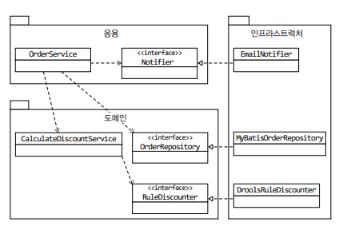
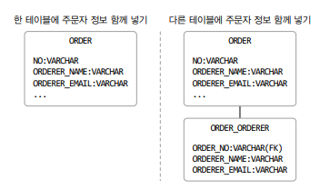
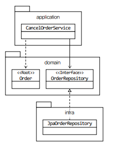

# 네 개의 영역

'표현', '응용', '도메인', '인프라스트럭처'는 아키텍처를 설계할 때 출현하는 전형적인 네 가지 영역이다. 표현 영역은 사용자의 요청을 받아 응용 영역에 전달하고 응용 영역의 처리 결과를 다시 사용자에게
보여주는 역할을 한다.

## 표현영역

웹 애플리케이션의 표현 영역은 HTTP 요청을 응용 영역이 필요로 하는 형식으로 변환해서 응용 영역에 전달하고 응용 영역의 응답을 HTTP 응답으로 변환하여 전송한다. 예를 들어 표현 영역은 웹 브라우저가 HTTP
요청 파라미터로 전송한 데이터를 응용 서비스가 요구하는 형식의 객체 타입으로 변환해서 전달하고, 응용 서비스가 리턴한 결과를 JSON 형식으로 변환해서 HTTP 응답으로 웹 브라우저에 전송한다.

## 응용영역

응용 영역은 시스템이 사용자에게 제공해야 할 기능을 구현하는데 '주문 등록', '주문 취소', '상품 상세 조회'와 같은 기능 구현을 예로 들 수 있다. 응용 영역은 기능을 구현하기 위해 도메인 영역의 도메인 모델을 사용한다.
주문 취소 기능을 제공하는 응용 서비스를 예로 살펴보면 다음과 같이 주문 도메인 모델을 사용해서 기능을 구현한다.

```java
public class CancelOrderService {
  @Transactional
  public void cancelOrder(String orderId) {
    Order order = findOrderById(orderId);
    if(order === null) throw new OrderNotFoundException(orderId);
    order.cancel();
  }
}
```

응용 서비스는 로직을 직접 수행하기보다는 도메인 모델에 로직 수행을 위임한다. 위의 코드도 주문 취소 로직을 구현하지 않고, Order 객체에 취소 처리를 위임하고 있다. 도메인 모델은 도메인의 핵심 로직을 구현한다.
예를 들어, 도메인은 '배송지 변경', '결제 완료', '주문 총액 계산'과 같은 핵심 로직을 도메인 모델에서 구현한다.

## 인프라스트럭처 영역

인프라 스트럭처 영역은 구현 기술에 대한 것을 다룬다. 이 영역은 RDBMS 연동을 처리하고, 메시징 큐에 메시지를 전송하거나 수신하는 기능을 구현하고, 몽고DB나 레디스와의 데이터 연동을
처리한다. 이 영역은 논리적인 개념을 표현하기보다는 실제 구현을 다룬다. 도메인, 응용, 표현 영역은 구현 기술을 사용할 코드를 직접 만들지 않는다. 대신 인프라스트럭처 영역에서 제공하는
기능을 사용해서 필요한 기능을 개발한다. <b>예를 들어 응용 영역에서 DB에 보관된 데이터가 필요하면 인프라스트럭처 영역의 <u>DB 모듈</u>을 사용하여 데이터를 읽어온다. 비슷하게 외부에 메일을 발송해야 한다면
인프라스트럭처가 제공하는 <u>SMTP 연동 모듈</u>을 이용해서 메일을 발송한다.</b>

<br>

# 계층 구조 아키텍처

'표현 -> 응용 -> 도메인 -> 인프라스트럭처'는 상위 계층에서 하위 계층으로의 의존만 존재하고 하위 계층은 상위 계층에 의존하지 않는 구조이다. 인프라스트럭처와 같은 하위 계층이
도메인에 의존하거나 도메인이 응용 계층에 의존하지 않는다.

계층 구조를 엄격하게 적용하면 상위 계층은 바로 아래 계층에만 의존해야 하지만, 구현의 편리함을 위해 계층 구조를 유연하게 적용하기도 한다. 예를 들어, 도메인과 응용 계층이 DB 연동 및 외부 시스템 연동을 위해 상세한 구현 기술을 다루는 인프라스트럭처 모듈에 의존(종속)하게 되는 경우도 있다.

도메인의 가격 계산 규칙을 예로 들어보자. 다음은 할인 금액을 계산하기 위해 Drools라는 룰 엔진을 사용해서 계산 로직을 수행하는 인프라스트럭처 영역의 코드를 만들어 본 것이다.

```java
public class DroolsRuleEngine {
  private KieContainer KContainer;

  public DroolsRuleEngine() {
    KieService ks = KieServices.Factory.get();
    kContainer = ks.getKieClasspathContainer();
  }

  public void evaluate(String sessionName, List<?> facts) {
    KieSession kSession = kContainer.newKieSession(sessionName);
    try {
      facts.forEach(x => kSession.insert(x));
      kSession.fireAllRules();
    } finally {
      kSession.dispose();
    }
  }
}
```

응용 영역은 가격 계산을 위해 인프라스트럭처 DroolsRuleEngine을 사용한다.

```java
public class CalculateDiscountService {
  private DroolsRuleEngine ruleEngine;

  public CalculateDiscountService() {
    ruleEngine = new DroolsRuleEngine();
  }

  public Money calculateDiscount(List<OrderLine> orderLines, String customerId) {
    Customer = customer = findCustomer(customerId);

    MutableMoney money = new MutableMoney(0);
    List<?> facts = Arrays.asList(customer, money);
    facts.addAll(orderLines);
    ruleEngine.evaluate("discountCalculation", facts);
    return money.toImmutableMoney();
  }
}
```

CaluculateDiscountService가 동작은 하겠지만 이 코드는 두 가지 문제점을 갖는다. 첫 번째는 CalculateDiscountService만 테스트하기 어렵다는 점이다. 이를 테스트하려면 RuleEngine이
완벽히 동작해야 한다. RuleEngine 클래스와 관련 설정 파일을 모두 만든 후에 비로소 CalculateDiscountService가 올바르게 동작하는지 확인할 수 있다. 두 번째 문제는 구현 방식을 변경하기 어렵다는 점이다.

```java
public class CalculateDiscountService {
  private DroolsRuleEngine ruleEngine;

  public CalculateDiscountService() {
    ruleEngine = new DroolsRuleEngine();
  }

  public Money calculateDiscount(List<OrderLine> orderLines, String customerId) {
    Customer = customer = findCustomer(customerId);

    MutableMoney money = new MutableMoney(0); // Drools에 특화된 코드:  연산 결과를 받기 위해 추가한 타입
    List<?> facts = Arrays.asList(customer, money); // Drools에 특화된 코드: 룰에 필요한 데이터(지식)
    facts.addAll(orderLines); // Drools에 특화된 코드: 룰에 필요한 데이터(지식)
    ruleEngine.evaluate("discountCalculation", facts); // Drools에 특화된 코드: "discountCalculation"은 Drools의 세션이름
    return money.toImmutableMoney();
  }
}
```

코드만 보면 Drools가 제공하는 타입을 직접 사용하지 않으므로 응용 계층이 인프라스트럭처에 의존하지 않는다고 생각할 수 있다. 하지만 'discountCalculation'이라는 문자열은
Drools의 세션 이름을 의미한다. 따라서, Drools의 세션 이름을 변경하면 CalculateDiscountService의 코드도 변경해야 한다. 또한 MutableMoney는 룰 적용 결과값을 보관하기 위해
추가한 타입인데 다른 방식을 사용했다면 필요없는 타입이다.

이처럼 CalculateDiscountService가 겉으로는 인프라스트럭처에 직접적인 의존을 하지 않는 것처럼 보여도 실제로는 Drools라는 인프라스트럭처 영역의 기술에 완전히 의존하고 있다.
이런 상황에서 Drools가 아닌 다른 구현 기술을 사용하려면 응용 계층의 코드를 많이 수정해야한다.

인프라스트럭처에 의존하면 '테스트 어려움'과 '기능 확장의 어려움'이라는 두 가지 문제가 발생하는 것을 알게 되었다. 이 문제의 해결법은 'DIP'에 있다.

# DIP

가격 할인 계산을 하려면 고객 정보를 구하고, 구한 고객 정보와 주문 정보를 이용해서 룰을 실행해야 한다.
즉, CalculateDiscountService라는 고수준 모듈은 '가격 할인 계산'이라는 기능을 구현하고, 이를 구현하기 위해서는 'RDBMS에서 JPA로 구한다', 'Drools로 룰을 적용한다'라는 저수준 모듈을 구현해야 한다.
(고수준 모듈이란, 의미있는 단일 기능을 제공하는 모듈이며, 고수준 모듈을 구현하기 위해서는 여러 하위 기능이 필요하다. 하위 기능을 실제로 구현한 것이 저수준 모듈이다.)

고수준 모듈이 제대로 동작하려면 저수준 모듈을 사용해야 한다. 그런데 고수준 모듈이 저수준 모듈을 사용하면 앞서 언급했던 두 가지 문제, 즉 구현 변경과 테스트가 어렵다는 문제가 발생한다.

DIP는 이를 해결하기 위해 저수준 모듈이 <u>고수준 모듈에 의존하도록 바꾼다.</u> 고수준 모듈을 만드려면 저수준 모듈을 사용해야 하는데, 반대로 저수준 모듈이 고수준 모듈에 의존하도록 하려면 어떻게 해야 할까? <u>비밀은 추상화한 인터페이스에 있다.</u>

CalculateDiscountService 입장에서 봤을때 룰 적용을 Drools로 구현했는지 자바로 직접 구현했는지는 중요하지 않다. '고객 정보와 구매 정보에 룰을 적용해서 할인 금액을 구한다'라는 것만 중요할 뿐이다. 이를 추상화한 인터페이스는 다음과 같다.

```java
public interface RuleDiscounter {
  Money applyRules(Customer customer, List<OrderLine> orderLines);
}
```

이제 CalculateDiscountService가 RuleDiscounter를 이용하도록 바꿔보자.

```java
public class CalculateDiscountService {
  private RuleDiscounter ruleDiscounter;

  public CalculateDiscountService(RuleDiscounter ruleDiscounter) {
    this.ruleDiscounter = ruleDiscounter;
  }

  public Money calculateDiscount(List<OrderLine> orderLines, String customerId){
    Customer customer = findCustomer(customerId);
    return ruleDiscounter.applyRules(customer, orderLine);
  }
}
```

CalculateDiscountService에는 Drools에 의존하는 코드가 없다. 단지 RuleDiscounter가 룰을 적용한다는 사실만 알뿐이다. <u>실제 RuleDiscounter의 구현 객체는 생성자를 통해서 전달받는다.</u>

룰 적용을 구현한 클래스는 RuleDiscounter 인터페이스를 상속받아 구현한다. 다시 말하지만 Drools 관련 코드를 이해할 필요는 없다. 여기서 중요한 건 RuleDiscounter를 상속받아 구현한다는 것이다.

```java
public class DroolsRuleDiscounter implements RuleDiscounter {
  private KieCounter kContainer;

  public DroolsRuleEngine() {
    KieService ks = KieServices.Factory.get();
    kContainer = ks.getKieClasspathContainer();
  }

  @Override
  public Money applyRules(Customer customer List<OrderLine> orderLines) {
    KieSession kSession = kContainer.newKieSession("discountSession");
    try {
      // 코드 생략
      kSession.fireAllRules();
    } finally {
      kSession.dispose();
    }
    return money.toImmutalbeMoney();
  }
}
```

CalculateDiscountService는 더 이상 구현 기술인 Drools에 의존하지 않는다. '룰을 이용한 할인 금액 계산'을 추상화한 RuleDiscounter 인터페이스에 의존할 뿐이다. '룰을 이용한 할인 금액 계산'은 고수준 모듈에 개념이므로 RuleDiscounter 인터페이스는 고수준 모듈에 속한다. DroolsRuleDiscounter는 고수준의 하위 기능인 RuleDiscounter를 구현한 것이므로 저수준 모듈에 속한다.

DIP를 적용하면 저수준 모듈이 고수준 모듈에 의존하게 된다. 고수준 모듈이 저수준 모듈을 사용하려면 고수준 모듈이 저수준에 의존해야 하는데, 반대로 저수준 모듈이 고수준 모듈에 의존한다고 해서 DIP(Dependency Inversion Principle), 즉 의존성 역전 원칙이라고 부른다.

DIP를 적용하면 앞의 다른 영역이 인프라스트럭처 영역에 의존할 때 발생했던 두 가지 문제인 구현 교체가 어렵다는 것과 테스트가 어려운 문제를 해소할 수 있다.

먼저 구현 기술 교체 문제를 보자. 고수준 모듈을 더 이상 저수준 모듈에 의존하지 않고 구현을 추상화한 인터페이스에 의존한다. 실제 사용할 저수준 구현 객체는 다음 코드처럼 의존 주입을 이용해서 전달받을 수 있다.

```java
// 사용할 저수준 객체 생성
RuleDiscounter ruleDiscounter = new DroolsRuleDiscounter();

// 생성자 방식으로 주입
CalculateDiscountService disService = new CalculateDiscountService(ruleDiscounter);
```

구현기술을 변경하더라도 CalculateDiscountService를 수정할 필요가 없다. 다음처럼 사용할 저수준 구현 객체를 생성하는 코드만 변경하면 된다.

```java
// 사용할 저수준 구현 객체 변경
RuleDiscounter ruleDiscounter = new SimpleRuleDiscounter();

// 생성자 방식으로 주입
CalculateDiscountService disService = new CalculateDiscountService(ruleDiscounter);
```

두번째 문제인 테스트에 대해 언급하기 전에 CalculateDiscountService가 제대로 동작하려면 Customer를 찾는 기능도 구현해야 한다. 이를 위해 고수준 인터페이스를 CustomerRepository라고 하자. CalculateDiscountService는 다음과 같이 두 인터페이스인 CustomerRepository와 RuleDiscounter를 사용해서 기능을 구현한다.

```java
public class CalculateDiscountService {
  private CustomerRepository customerRepository;
  private RuleDiscounter ruleDiscounter;

  public CalculateDiscountService(CustomerRepository customerRepository, RuleDiscounter ruleDiscounter) {
    this.customerRepository = customerRepository;
    this.ruleDiscounter = ruleDiscounter;
  }

  public Money calculateDiscount(List<OrderLine> orderLines, String customerId) {
    Customer customer = findCustomer(customerId);
    return ruleDiscounter.applyRules(customer, orderLines);
  }

  private Custoer findCustomer(String customerId) {
    Customer customer = customerRepository.findById(customerId);
    if(customer === null) throw new NoCustomerException();
  }
}
```

CalculateDiscountService가 제대로 동작하는지 테스트하려면 CustomerRepository와 RuleDiscounter를 구현한 객체가 필요하다. 만약 CalculateDiscounterService가 저수준 모듈에 직접 의존했다면 저수준 모듈이 만들어지기 전까지 테스트를 할 수 없었겠지만 CustomerRepository와 RuleDiscounter는 인터페이스이므로 대역 객체를 사용해서 테스트를 진행할 수 있다. 다음은 대역 객체를 사용해서 Customer가 존재하지 않는 경우 익셉션이 발생하는지 검증하는 테스트 코드의 예를 보여주고 있다.

```java
public class CalculateDiscountServiceTest {
  @Test
  public void noCustomer_thenExceptionShouldBeThrown() {
    // 테스트 목적의 대역 객체
    CustomerRepository stubRepo = mock(CustomerRepository.class);
    when(stubRepo.findById("no customerId")).thenReturn(null);

    RuleDiscounter stubRule = (cust, lines) => null;

    // 대용 객체를 주입 받아 테스트 진행
    CalculateDiscountService calDisSvc = new CalculateDiscountService(stubRepo, stubRule);
    assertThrows(NoCustomerException.class, () => calcDisSvc.calculateDiscount(someLines, "noCustId"));
  }
}
```

이 코드에서 stubRepo와 stubRule은 각각 CustomerRepository와 RuleDiscounter의 대역 객체다. stubRepo는 Mockito라는 Mock 프레임워크를 이용해서 대역 객체를 생성했고, stubRule은 메서드가 한 개여서 람다식을 이용해 객체를 생성했다. 두 대역 객체는 테스트를 수행하는데 필요한 기능만 수행한다.

위의 코드는 CustomerRepository와 RuleDiscounter의 실제 구현 클래스가 없어도 CalculateDiscountService를 테스트할 수 있음을 보여준다. 실제 구현 대신 스텁이나 모의 객체와 같은 테스트 목적의 대역을 사용하여 거의 모든 상황을 테스트할 수 있다.

이렇게 실제 구현 없이 테스트를 할 수 있는 이유는 DIP를 적용해서 고수준 모듈이 저수준 모듈에 의존하지 않도록 했기 때문이다. 고수준 모듈인 CalculateDiscountSErvice는 저수준 모듈에 직접 의존하지 않기 때문에 RDBMS를 이용한 CustomerRepository 구현 클래스와 Drools를 이용한 RuleDiscounter 구현 클래스가 없어도 테스트 대역을 이용해 거의 모든 기능을 테스트할 수 있는 것이다.

## DIP 주의 사항

DIP를 잘못 생각하면 단순히 인터페이스와 구현 클래스를 분리하는 정도로 받아들일 수 있다. DIP의 핵심은 고수준 모듈이 저수준 모듈에 의존하지 않도록 하기 위함이므로, 인터페이스는 고수준 모듈에서 도출해야 한다.

## DIP와 아키텍쳐



위의 이미지에서 인프라스트럭처 영역의 EmailNotifier 클래스는 응용영역 Notifier 인터페이스를 상속받고 있다. 주문 시 통지 방식에 SMS를 추가해야한다는 요구사항이 있을때, 응용영역의 OrderService는 변경할 필요 없이 EmailNotifier를 CompositeNotifier 클래스로 대체하면 된다. 마찬가지로 인프라스트럭처에 있는 MyBatisOrderRepository, DroolsRuleDiscounter를 모두 변경하더라도 응용영역과 도메인 영역은 바뀌지 않는다.

# 도메인 영역의 주요 구성 요소

도메인 영역은 도메인의 핵심 모델을 구현한다. 도메인 영역의 모델은 도메인의 주요 개념을 표현하며 핵심 로직을 구현한다. 1장에서 살펴본 엔티티와 벨류 타입은 도메인 영역의 주요 구성요소이다.

### 엔티티

- 고유의 식별자를 갖는 객체로 자신의 라이프 사이클을 갖는다.
- 주문, 회원, 상품과 괕이 도메인의 고유한 개념을 표현한다.
- 도메인 모델의 데이터를 포함하며 데이터와 관련된 기능도 함께 제공한다.

### 밸류

- 고유의 식별자를 갖지 않는 객체로 주로 개념적으로 하나의 값을 표현할 때 사용한다.
- 주소, 금액과 같은 타입이 밸류 타입이다.
- 엔티티의 속성으로 뿐만 아니라 다른 밸류 타입의 속성으로도 사용할 수 있다.

### 애그리거트

- 애그리거트는 연관된 엔티티와 밸류 객체를 개념적으로 하나로 묶은 것이다.
- 주문과 관련된 Order 엔티티, OrderLine 밸류, Orderer 밸류 객체를 주문 애그리거트로 묶을 수 있다.

### 리포지터리

- 도메인 모델의 영속성을 처리한다.
- DBMS 테이블에서 엔티티 객체를 로딩하거나 저장하는 기능을 한다.

### 도메인 서비스

- 특정 엔티티에 속하지 않은 도메인 로직을 제공한다.
- 할인 금액 계산은 상품, 쿠폰, 회원 등급, 구매 금액 등 다양한 조건을 이용해 구현하는데, 이렇게 도메인 로직이 여러 엔티티와 밸류를 필요로 하면 도메인 서비스에서 로직을 구현한다.

## 엔티티와 밸류

도메인 모델의 엔티티와 관계형 모델의 엔티티는 같은 것이 아니다. 이 두 모델의 가장 큰 차이점은 도메인 모델의 엔티티는 데이터와 도메인 기능을 함께 제공한다는 점이다. 도메인 모델의 엔티티는 단순히 데이터만 담고 있는 데이터 구조라기보다는 데이터와 기능을 제공하는 객체이다. 도메인 관점에서 기능을 구현하고 기능 구현을 캡슐화해서 데이터가 임의로 변경되는 것을 막는다.

또 다른 차이점은 도메인 모델의 엔티티는 두 개 이상의 데이터가 개념적으로 하나인 경우 밸류 타입을 이용해서 표현할 수 있다는 것이다.

```java
public class Order {
  // 주문 도메인 모델의 데이터
  private OrderNo number;
  private Orderer orderer;
  private ShippingInfo shippingInfo;

  // 도메인 모델 엔티티는 도메인 기능도 함께 제공
  public void changeShippingInfo(ShippingInfo newShippingInfo) {
    //...
  }
}
 public class Orderer {
   private String name;
   private String email;
 }

```



RDBMS와 같은 관계형 데이터베이스는 밸류 타입을 표현하기 힘들다. 왼쪽 이미지의 경우 Orderer 개별 데이터를 Order 테이블에 함께 저장하거나 오른쪽 이미지처럼 별도 테이블로 분리해서 저장해야한다.

왼쪽의 경우, 주문자라는 개념이 드러나지 않고 주문자의 개별 데이터(이름과 이메일) 만 드러난다. 오른쪽의 경우 주문자 데이터를 별도 테이블에 저장했지만 이것은 테이블의 엔티티에 가까우며 밸류 타입의 의미가 드러나지는 않는다. 반면 도메인 모델의 Orderer는 주문자를 개념을 잘 반영하므로 도메인을 보다 잘 이해할 수 있도록 돕는다.

밸류는 불변으로 구현할 것을 권장하며, 엔티티의 밸류 타입 데이터를 변경할 때는 객체를 완전히 교체하는 것을 의미한다.

## 애그리거트

도메인이 커질수록 도메인 모델도 커지면서 모델이 점점 복잡해진다. 개발자는 전체 구조가 아닌 엔티티와 밸류 개별 단위에만 집중하게 되는데, 이는 큰 틀에서 모델을 관리하기 어려워진다. 도메인 모델에서 전체 구조를 이해하는데 도움이 되는 것이 바로 애그리거트이다.

애그리거트는 관련 객체를 하나로 묶은 군집이다. 애그리거트의 대표적인 예가 주문이다. 주문이라는 도메인 개념은 주문, 배송지 정보, 주문자, 주문 목록, 총 결제 금액의 하위 모델로 구성된다. 이 하위 개념을 표현한 모델을 하나로 묶어서 주문이라는 상위 개념으로 표현할 수 있다.

애그리거트는 하나의 루트 엔티티를 갖는다. 루트 엔티티는 애그리거트에 속해 있는 엔티티와 밸류 객체를 이용해서 애그리거트가 구현해야 할 기능을 제공한다. 애그리거트를 사용하는 코드는 애그리거트 루트가 제공하는 기능을 실행하고 애그리거트를 통해서 직간접적으로 애그리거트 내의 다른 엔티티나 밸류에 접근한다.

애그리거트를 구현할떄는 고려할 것이 많다. 애그리거트를 어떻게 구성했느냐에 따라 구현이 복잡해지기도 하고 트랜잭션의 범위가 달라지기도 한다. 또한 선택한 구현 기술에 따라 애그리거트 구현에 제약이 생기기도 한다.

## 리포지터리

도메인 객체를 지속적으로 사용하려면 물리적인 저장소에 도메인 객체를 보관하는데, 이를 위한 도메인 모델이 리포지터리이다. 엔티티나 밸류가 요구사항에서 도출되는 도메인 모델이라면 리포지터리는 구현을 위한 도메인 모델이다.

리포지터리는 애그리거트 단위로 도메인 객체를 저장하고 조회하는 기능을 정의한다.

```java
public interface OrderRepository {
  Order findByNumber(OrderNumber number);
  void save(Order order);
  void delete(Order order);
}
```

OrderRepository의 메서드를 보면 대상을 찾고 저장하는 단위가 애그리거트루트인 Order인 것을 알 수 있다. Order는 애그리거트에 속한 모든 객체를 포함하고 있으므로 결과적으로 애그리거트 단위로 저장하고 조회한다.

도메인 모델을 사용해야 하는 코드는 리포지터리를 통해서 도메인 객체를 구한 뒤에 도메인 객체의 기능을 실행한다.

도메인 모델 관점에서 OrderRepository는 도메인 객체를 영속화하는데 필요한 기능을 추상화한 것으로 고수준 모듈에 속하고, 기반 기술을 이용해서 OrderRepository를 구현한 클래스는 저수준 모듈로 인프라스트럭처 영역에 속한다.



응용 서비스는 의존 주입과 같은 방식으로 실제 리포지터리 구현 객체에 접근한다. 응용 서비스와 리포지터리는 밀접한 관련이 있는데, 그 이유는 다음과 같다.

- 응용 서비스는 필요한 도메인 객체를 구하거나 저장할때 리포지터리를 사용한다.
- 응용 서비스는 트랜잭션을 관리하는데, 트랜잭션 처리는 리포지터리 구현 기술의 영향을 받는다.
