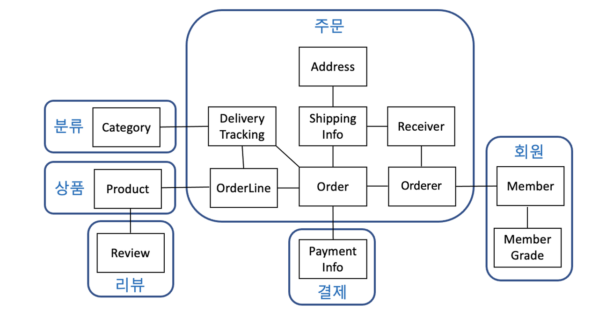
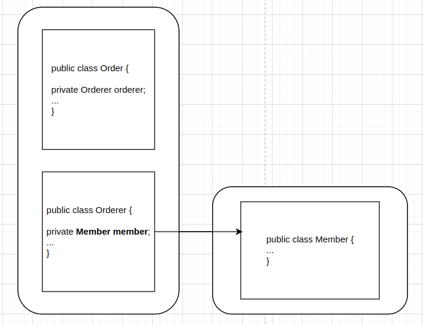
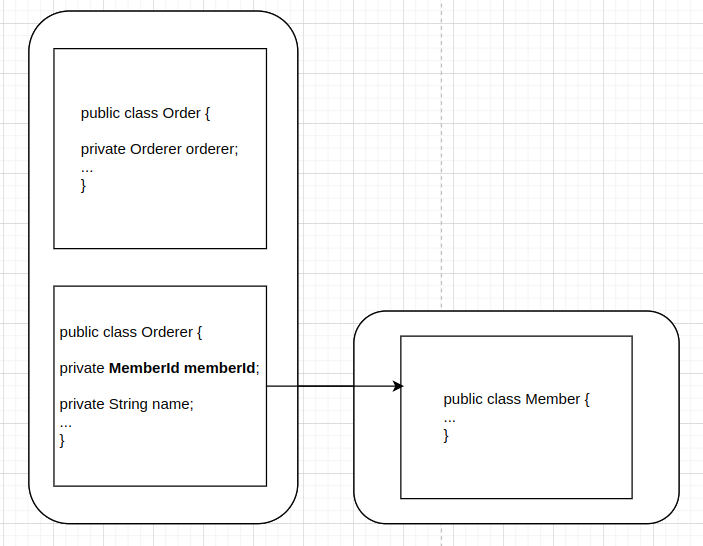

# 3.1 애그리거트

도메인 객체 모델이 복잡해지면 개별 구성요소 위주로 모델을 이해하게 되고 전반적인 구조나 큰 수준에서 도메인 간 관계를 파악하기 어렵다. 큰 수준에서 구조를 파악하지 못하면 코드를 변경하고 확장하는 것이 어려워진다. 상위 수준에서 모델이 어떻게 엮여 있는지 알아야 전체 모델을 망가뜨리지 않으면서 추가 요구사항을 모델에 반영할 수 있는데, 세부적인 모델만 이해한 상태로는 코드를 수정하는 것이 꺼려지기 때문에 코드 변경을 회피하는 쪽으로 요구사항을 협의하게 된다.

즉, 복잡한 도메인을 이해하고 관리하기 쉬운 단위로 만들려면 상위 수준에서 모델을 조망할 수 있는 방법이 필요한데, 그 방법이 바로 애그리거트다. 여러 객체를 애그리거트로 묶어서 바라보면 상위 수준에서 도메인 모델 간의 관계를 파악할 수 있다.



위의 이미지는 애그리거트로 모델을 표현한 것으로, 모델 간의 관계를 개별 모델수준과 상위수준에서 모두 이해할 수 있다.

<br>

### <u>애그리거트에 속한 객체는 유사하거나 동일한 라이프 사이클을 갖는다.</u>

애그리거트는 관련된 모델을 하나로 모았기 때문에 한 애그리거트에 속한 객체는 유사하거나 동일한 라이프 사이클을 갖는다. 주문 애그리거트를 만드려면 Order, OrderLine, Orderer와 같은 객체를 함께 생성해야 한다. Order는 생성했는데, ShippingInfo는 만들지 않거나 ShippingInfo를 생성하면서 Orderer를 생성하지 않는 경우는 없다. 도메인 규칙에 따라 최초 주문 시점에 일부 객체를 만들 필요가 없는 경우도 있지만 애그리거트에 속한 구성요소는 대부분 함께 생성하고 함께 제거한다.

<br>

### <u> 애그리거트는 경계를 갖는다.</u>

- 함께 생성되는지
- 함께 변경되는지
- 생성/변경이 서로에게 영향을 주는지

한 애그리거트에 속한 객체는 다른 애그리거트에 속하지 않는다. 애그리거트는 독립된 객체 군이며 각 애그리거트는 자기 자신을 관리할 뿐 다른 애그리거트를 관리하지 않는다. 예를 들어 주문 애그리거트는 배송지를 변경하거나 주문 상품 개수를 변경하는 등 자기 자신은 관리하지만, 주문 애그리거트에서 회원의 비밀번호를 변경하거나 상품의 가격을 변경하지는 않는다.

경계를 설정할때 기본인 되는 것이 도메인 규칙과 요구사항이다. 도메인 규칙에 따라 함께 생성되는 구성요소는 한 애그리거트에 속할 가능성이 높다. 주문할 상품 개수, 배송지 정보, 주문자 정보는 주문 시점에 함께 생성되므로 이들은 한 애그리거트에 속한다. 또한 OrderLine의 주문 상품 개수를 변경하면 도메인 규칙에 따라 Order의 총 주문 금액을 다시 계산해야한다. 사용자 요구사항에 따라 주문 상품 개수와 배송지를 함께 변경하기도 한다. 이렇게 함께 변경되는 빈도가 높은 객체는 한 애그리거트에 속할 가능성이 높다.

흔히 A가 B를 갖는다고 표현할 수 있다면, A,B를 하나의 애그리거트로 묶어서 생각하기 쉽다. 예를 들어, Order가 ShippingInfo와 Orderer를 가지고 이들을 같은 애그리거트에 묶여있다. 하지만, 모든 경우에 해당되는 것은 아니다.

예를 들어, 상품과 리뷰를 생각해보자. 상품 페이지에 들어가면 상품 상세 정보와 함께 리뷰 내용을 보여줘야 한다는 요구사항이 있을때 Product 엔티티와 Review 엔티티가 한 애그리거트에 속한다고 생각할 수 있다. 하지만 Product와 Review는 함께 생성되지 않고, 함께 변경되지도 않는다. 게다가 Product를 변경하는 주체가 상품 담당자라면 Review를 생성하고 변경하는 주체는 고객이다.

Review의 변경이 Product에 영향을 주지 않고 반대로 Product의 변경이 Review에 영햐을 주지 않기 때문에 이 둘은 한 애그리거트에 속하기 보다는 서로 다른 애그리거트에 속한다.

<br>

# 3.2 애그리거트 루트

주문 애그리거트는 다음을 포함한다.

- 총 금액인 totalAmounts를 가지고 있는 Order 엔티티
- 개별 구매 상품의 개수인 quantity와 금액인 price를 가지고 있는 OrderLine 밸류

애그리거트는 여러 객체로 구성되기 때문에 한 객체만 상태가 정상이면 안 된다. 도메인 규칙을 지키려면 애그리거트에 속한 모든 객체가 정상 상태를 가져야 한다. 주문 애그리거트에서는 OrderLine을 변경하면 Order의 totalAmounts도 다시 계산해서 총 금액이 맞아야 한다.

애그리거트에 속한 모든 객체가 일관된 상태를 유지하려면 애그리거트 전체를 관리할 주체가 필요한데, 이 책임을 지는 것이 바로 애그리거트의 루트 엔티티이다. 애그리거트 루트 엔티티는 애그리거트의 대표 엔티티로 애그리거트에 속한 객체는 루트 엔티티에 직접 또는 간접적으로 속하게 된다.

<br>

### <u><i>도메인 규칙과 일관성</i></u>

애그리거트 루트의 핵심 역할은 애그리거트의 일관성이 깨지지 않도록 하는 것이다. 이를 위해 애그리거트 루트는 애그리거트가 제공해야 할 도메인 기능을 구현한다. 예를 들면 주문 애그리거트는 배송지 변경, 상품 변경과 같은 기능을 제공하고, 애그리거트 루트인 Order가 이 기능을 구현한 메서드를 제공한다.

```java

public class Order {
  // 애그리거트 루트는 도메인 규칙을 구현한 기능을 제공한다.
  public void changeShippingInfo(ShippingInfo newShippingInfo) {
    verifyNotYetShipped();
    setShippingInfo(newShippingInfo);
  }

  private void verifyNotYetShipped() {
    if(state != OrderState.PAYMENT_WAITING && state != OrderState.PREPARING)
      throw new IllegalStateException("already shipped");
  }
}
```

위와 같이 애그리거트 루트 내에서 배송지 정보를 변경해야 한다. 애그리거트 외부에서 애그리거트에 속한 객체를 직접 변경하면 안된다. 이것은 애그리거트가 강제하는 규칙을 적용할 수 없어 모델의 일관성을 깨는 원인이 된다. 다음 코드를 보자.

```java
ShippingInfo si = order.getShippingInfo();
si.setAddress(newAddress);
```

이 코드는 애그리거트 루트인 Order에서 ShippingInfo를 가져와 직접 정보를 변경하고 있다. 주문 상태에 상관없이 배송지 주소를 변경하는데, 이는 배송 시작 전까지만 배송지 정보를 변경할 수 있다는 규칙을 무시하고 직접 DB 테이블의 데이터를 수정하는 것과 같은 결과를 만든다.

일관성을 강제하기 위해 다음과 같이 상태 확인 로직을 응용 서비스에 구현할 수도 있지만, 이렇게 되면 동일한 검사 로직을 여러 응용 서비스에서 중복으로 구현할 가능성이 높아져 유지 보수에 도움이 되지 않는다.

```java
ShippingInfo si = order.getShippingInfo();

//주요 도메인 로직이 중복되는 문제
if(state != OrderState.PAYMENT_WAITING && state != OrderState.PREPARING) {
  throw new IllegalArgumentException();
}
si.setAddress(newAddress);
```

불필요한 중복을 피하고 애그리거트 루트를 통해서만 도메인 로직을 구현하게 만들려면 도메인 모델에 대해 다음의 두가지를 습관적으로 적용해야 한다.

- 단순히 필드를 변경하는 set 메서드를 공개(public 범위로 만들지 않는다.
- 밸류 타입은 불변으로 구현한다. (대신 재할당을 활용한다.)

먼저 습관적으로 작성하는 공개 (public) set 메서드를 피해야 한다. 보통 이는 필드에 값을 할당하는 것으로 끝나는 경우가 많고, 잘해야 null을 검사하는 정도이다.

```java
// 도메인 모델에서 공개 set 메서드는 가급적 피해야 한다.
public void setName(String name) {
  this.name = name;
}
```

공개 set 메서드는 도메인의 의미나 의도를 표현하지 못하고 도메인 로직을 도메인 객체가 아닌 응용 영역이나 표현 영역으로 분산시킨다. 도메인 로직이 한 곳에 응집되지 않으므로 코드를 유지 보수할 때에도 분석하고 수정하는 데 더 많은 시간이 필요하다.

대신, 의미가 드러나는 메서드를 사용해서 구현하도록 한다. cancel이나 changePassword 처럼 의미가 더 잘 드러나는 이름을 사용한다.

다음으로, 밸류는 불변 타입으로 구현한다. 밸류 객체를 변경할 수 없으면 애그리거트 루트에서 밸류 객체를 구해도 애그리거트 외부에서 밸류 객체의 상태를 변경할 수 없다. 밸류 객체가 불변이면 밸류 객체의 값을 변경하는 방법은 새로운 밸류 객체를 할당하는 것 뿐이다.

```java
Shipping si = order.getShippingInfo();
si.setAddress(newAddress); // ShippingInfo가 불변이면 이 코드는 컴파일 에러

public class Order {
  private ShippingInfo shippinginfo;

  public void changeShippingInfo(ShippingInfo newShippingInfo) {
    verifyNotYetShipped();
    setShippingInfo(newShippingInfo);
  }

  //set 메서드의 접근 허용 범위는 private
  private void setShippingInfo(ShippingInfo newShippingInfo) {
    // 밸류가 불변이면 새로운 객체를 할당해서 값을 변경해야 한다.
    // 불변이므로 this.shippingInfo.setAddress(newShippingInfo.getAddress())와 같은 코드는 사용할 수 없다
    this.shippingInfo = newShippingInfo;
  }
}
```

밸류 타입의 내부 상태를 변경하려면 애그리거트 루트를 통해서만 가능하다. 그러므로 애그리거트 루트가 도메인 규칙을 올바르게 구현하면 애그리거트 전체의 일관성을 올바르게 유지할 수 있다.

### <u><i>애그리거트 루트의 기능 구현</i></u>

애그리거트 루트는 애그리거트 내부의 다른 객체를 조합해서 기능을 완성한다. 예를 들어 Order는 총 주문 금액을 구하기 위해 OrderLine 목록을 사용한다.

```java
public class Order {
  private Money totalAmounts;
  private List<OrderLine> orderLines;

  private void calculateTotalAmounts() {
    int sum = orderLines.straeam().mapToInt(ol => ol.getPrice()*ol.getQuality()).sum();

    this.totalAmounts = new Money(sum);
  }
}
```

또 다른 예로 회원을 표현하는 Member 애그리거트 루트는 암호를 변경하기 위해 Password 객체에 암호가 일치하는지를 확인할 것이다.

```java
public class Member {
  private Password password;

  public void changePassword(String currentPassword, String newPassword) {
    if(!password.match(currentPassword)) {
      throw new PasswordNotMatchException();
    }
    this.password = new Password(newPassword)
  }
}
```

애그리거트 루트가 구성요소의 상태만 참조하는 것은 아니다. 기능 실행을 위임하기도 한다. 예를 들어 구현 기술의 제약이나 내부 모델링 규칙 때문에 OrderLine 목록을 별도 클래스로 분리했다고 해보자.

```java
public class OrderLines {
  private List<OrderLine> lines;

  public Money getTotalAmounts() {}
  public void changeOrderLines(List<OrderLine> newLines) {
    this.lines = newLines;
  }
}
```

이 경우 Order의 changeOrderLines() 메서드는 다음과 같이 내부의 orderLines 필드의 상태 변경을 위임하는 방식으로 기능을 구현한다.

```java

public class Orer {
  private OrderLines orderLines;

  public void changeOrderLines(List<OrderLine> newLines) {
    orderLines.changeOrderLines(newLines);
    this.totalAmounts = orderLines.getTotalAmounts();
  }
}
```

OrderLines는 changeOrderLines()와 getTotalAmounts 같은 기능을 제공한다. 만약 Order가 getOrderLines()와 같이 OrderLines를 구할 수 있는 메서드를 제공하면 애그리거트 외부에서 OrderLines의 기능을 실행할 수 있게 된다. 애그리거트 루트 외부에서 OrderLines를 변경할 수 있게되므로 의도치 않은 버그가 발생할 수 있다. 따라서, 이 경우에는 OrderLines를 불변으로 구현하거나, OrderLines의 변경기능을 패키지나 protected 범위로 한정해서 외부에서 실행할 수 없도록 제한하는 방법이 있다.

### <u><i>트랜잭션 범위</i></u>

트랜잭션의 범위는 작을수록 좋다. 한 트랜잭션이 한 개의 테이블을 수정하는 것과 세 개의 테이블을 수정하는 것을 비교하면 성능에 차이가 발생한다.

동일하게 한 트랜잭션에서는 한 개의 애그리거트만 수정해야한다. 한 트랜잭션에서 두 개 이상의 애그리거트를 수정하면 트랜잭션 충돌이 발생할 가능성이 높아지기 때문에 한 번에 수정하는 애그리거트가 많을수록 전체 처리량이 떨어지게 된다.

한 트랜잭션에서 하나의 애그리거트만 수정한다는 것은 애그리거트에서 다른 애그리거트를 변경하지 않는다는 것을 의미한다. 한 애그리거트에서 다른 애그리거트를 수정하면 결과적으로 두 개의 애그리거트를 한 트랜잭션에서 수정하게 되므로 애그리거트 내부에서 다른 애그리거트의 상태를 변경하는 기능을 실행하면 안 된다.

애그리거트는 자신의 책임 범위를 넘어 다른 애그리거트의 상태를 변경해서는 안된다. 애그리거트는 최대한 서로 독립적이어야하는데 한 애그리거트가 다른 애그리거트의 기능에 의존하기 시작하면 애그리거트 간 결합도가 높아진다. 결합도가 높아질수록 향후 수정 비용이 증가하므로 애그리거트에서 다른 애그리거트의 상태를 변경하지 말아야한다.

<b>부득이하게 한 트랜잭션으로 두 개 이상의 애그리거트를 수정해야한다면 애그리거트에서 다른 애그리거트를 직접 수정하지 말고 응용서비스에서 두 애그리거트를 수정하도록 구현한다.</b>

<b>도메인 이벤트를 사용하면 한 트랜잭션에서 한 개의 애그리거트를 수정하면서도 동기나 비동기로 다른 애그리거트의 상태를 변경하는 코드를 작성할 수 있다.(10장에서 계속)</b>

한 트랜잭션에서 한 개의 애그리거트를 변경하는 것을 권장하지만, 다음의 경우에는 한 트랜잭션에서 두 개 이상의 애그리거트를 변경하는 것을 고려할 수 있다.

- 팀 표준

  팀이나 조직의 표준에 따라 사용자 유즈케이스와 관련된 응용 서비스 기능을 한 트랜잭션으로 실행해야하는 경우가 있다.

- 기술 제약

  기술적으로 이벤트 방식을 도입할 수 없는 경우 한 트랜잭션에서 다수의 애그리거트를 수정해서 일관성을 처리해야한다.

- UI 구현의 편리

  운영자의 편리함을 위해 주문 목록화면에서 여러 주문의 상태를 한 번에 변경하고 싶을 수 있다. 이 경우 한 트랜잭션에서 여러 주문 애그리거트의 상태를 변경해야한다.

# 3.3 리포지터리와 애그리거트

- 리포지터리는 애그리거트 단위로 존재한다.

  - Order와 OrderLine을 물리적으로 각각 별도의 DB 테이블에 저장한다고 해서 리포지터리를 각각 만들지 않는다. Order가 애그리거트 루트고, OrderLine은 애그리거트에 속하는 구성요소이므로 Order를 위한 리포지터리만 존재한다.

  - 애그리거트는 개념적으로 하나이므로 리포지터리는 애그리거트 전체를 저장소에 영속화해야한다. 예를 들어, Order 애그리거트에 관련된 테이블이 세 개라면, Order 애그리거트를 저장할때, 애그리거트 루트와 ㅁ매핑되는 테이블 뿐만 아니라 애그리거트에 속한 모든 구성요소(OrderLine, Orderer)에 매핑된 테이블도 데이터를 저장해야한다.

- 새로운 애그리거트를 만들면 저장소에 애그리거트를 영속화하고 하고 (save), 저장소에서 애그리거트를 읽어야 하므로(findById), 리포지터리는 보통 다음 두 개의 메서드를 기본으로 제공한다.

  - findById로 조회한 애그리거트는 완전한 애그리거트, 즉 구성 요소를 모두 포함한 애그리거트를 제공해야한다. 온전한 애그리거트가 아닌 경우, 기능 실행 중 NullPointerException과 같은 문제가 발생할 수 있다.

  - 이 두 메서드 외에 필요에 따라 다양한 조건으로 애그리거트를 검색하는 메서드나 애그리거트를 삭제하는 메서드를 추가할 수 있다.

- 어떤 기술로 리포지터리를 구현하느냐에 따라 애그리거트의 구현도 영향을 받는다.

  - ORM 기술 중 하나인 JPA를 사용하면 데이터베이스 관계형 모델에 객체 도메인 모델을 맞춰야 할 때도 있다. 레거시 DB를 사용하거나 팀 내 DB 설계 표준을 따라야 한다면 DB 테이블 구조에 맞게 모델을 변경해야 한다. 이 경우 밸류 타입인 도메인 모델을 @Component(JPA에서 밸류 타입을 매핑할때 사용하는)가 아닌 @Entity(엔티티를 매핑할때 사용하는)를 이용해야 할 수도 있다.

  - 저장소의 종류(RDBMS, NoSQL)와 관계없이 애그리거트의 상태가 변경되면 모든 변경을 원자적으로 저장소에 반영해야한다. 애그리거트의 두 개의 객체를 변경했는데 하나의 변경만 반영되면 데이터의 일관성이 깨지므로 문제가 된다. RDBMS를 이용해서 리포지터리를 구현하면 트랜잭션을 이용해서 애그리거트의 변경이 저장소에 반영되는 것을 보장할 수 있다. 몽고 DB를 사용하면 한 개의 애그리거트를 한 개 문서에 저장함으로써 한 애그리거트의 변경을 손실없이 저장소에 반영할 수 있다. (RDBMS와 JPA로 리포지터리 구현은 4장에서 계속)

# 3.4 ID를 이용한 애그리거트 참조

한 객체가 다른 객체를 참조하는 것처럼 애그리거트도 다른 애그리거트를 참조한다. 애그리거트 관리 주체는 애그리거트 루트이므로 애그리거트에서 다른 애그리거트를 참조한다는 것은 다른 애그리거트의 루트를 참조한다는 것과 같다.

애그리거트 간의 참조는 필드를 통해 쉽게 구현할 수 있다. 예를 들어 주문 애그리거트에 속해 있는 Orderer는 주문한 회원을 참조하기 위해 회원 애그리거트 루트인 Memeber를 필드로 참조할 수 있다.



Orderer에서 Order 외의 다른 애그리거트인 Member를 직접 참조하고 있다. 이러한 방식은 다음과 같이 Order 애그리거트에서 다른 애그리거트인 Member에 접근할 수 있다는 편리함을 준다. JPA는 @ManyToOne, @OneToOne과 같은 annotation을 이용해서 연관된 객체를 로딩하는 기능을 제공하고 있으므로 필드를 이용해 다른 애그리거트를 쉽게 참조할 수 있다. 하지만 이는 서로 다른 애그리거트에서 상태를 변경하게 되므로, 문제가 발생할 수 있다.

```java
order.getOrderer().getMember().getId();
```

- 편한 탐색 오용

  애그리거트를 직접 참조할 때, 발생할 수 있는 가장 큰 문제는 편리함 오용이다. A 애그리거트에서 B애그리거트에 접근할 수 있으면 다른 애그리거트의 상태를 쉽게 변경할 수 있게 된다. 트랜잭션 범위에서 언급한 것처럼 한 애그리거트가 관리하는 범위는 자기 자신으로 한정해야 한다. 그런데 애그리거트 내부에서 다른 애그리거트에 접근할 수 있으면 다음 코드처럼 구현의 편리함 때문에 다른 애그리거트를 수정하게 될 수 있다.

  ```java
  public class Order {
    private Orderer orderer;

    // Order 애그리거트에서 배송지 정보를 변경하면서 Member 애그리거트의 주소 정보도 함께 변경
    public void changeShippingInfo(ShippingInfo newShippingInfo, boolean useNewShippingAddrAsMemberAddr) {

      // 배송지 정보 변경 기능 구현 생략

      // 새로운 배송지 정보를 멤버의 주소 정보로 변경하는 flag가 true
      if(useNewShippingAddrAsMemberAddr) {
        // 한 애그리거트 내부에서 다른 애그리거트에 접근할 수 있으면
        // 구현이 쉬워진다는 것 때문에 다른 애그리거트의 상태를 변경하는
        // 유혹에 빠지기 쉽다.
        orderer.getMember().changeAddress(newShippingInfo.getAddress())
      }
    }
  }
  ```

  한 애그리거트에서 다른 애그리거트의 상태를 변경하는 것은 애그리거트 간의 의존 결합도를 높여서 결과적으로 애그리거트의 변경을 어렵게 만든다.

<br>
- 애그리거트를 직접 참조하면 성능과 관련된 여러 가지 고민을 해야한다는 것이다.

JPA를 사용하면 lazy(관계가 설정된 객체를 명시적으로 join할때만 로딩), eager(관계가 설정된 객체 즉시 로딩) 로딩 두 가지 방식으로 참조한 객체를 로딩할 수 있다. 두 방식 중 무엇을 사용할지는 애그리거트의 어떤 기능을 사용하느냐에 따라 달라진다. 단순히 연관된 객체의 데이터를 함께 화면에 보여줘야하면 즉시 로딩이 조회 성능에 유리하지만 애그리거트의 상태를 변경하는 기능을 실행하는 경우에는 불필요한 객체를 함께 로딩할 필요가 없으므로 지연 로딩이 유리할 수 있따. 이런 다양한 경우의 수를 고려해서 연관 매핑과 JPQL/Criteria 쿼리 로딩 전략을 결정해야 한다.

<br>
- 확장성 문제도 있다.

초기에는 단일 DBMS로 서비스를 제공하는 것이 가능하지만, <i>사용자가 늘고 트래픽이 증가하면 자연스럽게 부하를 분산하기 위해 하위 도메인별로 시스템을 분리하기 시작한다.</i> 도메인마다 다른 DBMS를 사용할 때도 있는데, 심지어 하위 도메인마다 다른 종류의 데이터 저장소를 사용하기도 한다. 애그리거트마다 다른 DB에 저장되어있다면, 애그리거트를 직접 참조하기 위해 JPA와 같은 단일 기술을 사용할 수 없음을 의미한다.

이런 세가지 문제를 완화할 수 있는 것이 ID를 이용해 다른 애그리거트를 참조하는 것이다. DB 테이블에서 외래키로 참조하는 것과 비슷하게 ID를 이용한 참조는 다른 애그리거트를 참조할때 ID를 사용한다.



ID 참조를 사용하면 모든 객체가 참조로 연결되지 않고 한 애그리거트에 속한 객체들만 참조로 연결된다. 이는 애그리거트의 경계를 명확히 하고 애그리거트 간 물리적인 연결을 제거하기 때문에 모델의 복잡도를 낮춰준다. 또한 애그리거트 간의 의존을 제거하므로 응집도를 높여주는 효과도 있다.

구현 복잡도도 낮아진다. 다른 애그리거트를 직접 참좋지 않으므로 애그리거트 간 참조를 지연 로딩으로 할지 즉시 로딩으로 할지 고민하지 않아도 된다. 참조하는 애그리거트가 필요하면 응용 서비스에서 ID를 이용해서 로딩하면 된다.

```java
public class ChangeOrderService {

  @Transactional
  public void changeShippingInfo(OrderId id, ShippingInfo newShippingInfo, boolean useNewShippingAddrAsMemberAddr) {
    Order order = orderRepository.findById(id);
    if(order == null) throw new OrderNotfoundException();
    order.changeShippingInfo(newShippingInfo);
    if(useNewShippingAddrAsmemberAddr) {
      /*
        애그리거트에서 다른 애그리거트를 참조하는 것과 다르게, 서비스 레이어에서 Order 멤버의 아이디
      */
      Member member = memberRepository.findById(order.getOrderer().getMemberId());
      member.changeAddress(newShippingInfo.getAddress());
    }
  }
}
```

응용 서비스에서 필요한 애그리거트를 로딩하므로 애그리거트 수준에서 지연 로딩을 하는 것과 동일한 것과 동일한 결과를 만든다.

ID를 이용한 참조 방식을 사용하면 복잡도를 낮추는 것과 함께 한 애그리거트에서 다른 애그리거트를 수정하는 문제를 근원적으로 방지할 수 있다. 외부 애그리거트를 직접 참조하지 않기 때문에 애초에 한 애그리거트에서 다른 애그리거트의 상태를 변경할 수 없는 것이다.

애그리거트 별로 다른 구현기술을 사용하는 것도 가능해진다. 중요한 데이터인 주문 애그리거트는 RDBMS에 저장하고 조회 성능이 중요한 상품 애그리거트는 NoSQL에 저장할 수 있다. 또한 각 도메인을 별도 프로세스로 서비스하도록 구현할 수도 있다.

## 3.4.1 ID를 이용한 참조와 조회 성능

### N+1 조회 문제

다른 애그리거트를 ID로 참조하면 참조하는 애그리거트를 읽을때 조회 속도가 문제될 수 있다. 예를 들어 주문 목록을 보여주려면 상품 애그리거트와 회원 애그리거트를 함께 읽어야 하는데, 이를 처리할 때 다음과 같이 각 주문마다 상품과 회원 애그리거트를 읽어온다고 해보자. DBMS에 데이터가 있다면 조인을 이용해서 한 번에 모든 데이터를 가져올 수 있음에도 불구하고 주문마다 상품 정보를 읽어오는 쿼리를 실행하게 된다.

```java
Member member = memberRepository.findById(ordererId);

List<Order> orders = orderRepository.findByOrderer(ordererId);
List<OrderView> dtos = orders.stream().map(order => {
                          ProductId prodId = order.getOrderLines.get(0).getProductId();
                          Product = product = productRepository.findById(prodId);
                          return new OrderView(order, member, product);
                        }).collect(toList());
```

위 코드는 주문 개수가 10개면 주문을 읽어오기 위한 1번의 쿼리와 주문별로 상품을 읽어오기 위한 1번의 쿼리와 (ordererId로 주문목록을 조회해오는 쿼리) 각 주문별로 첫번째 상품을 읽어오는 10번의 쿼리를 실행한다. 조회 대상이 N개일때 N개를 읽어오는 한 번의 쿼리와 연관된 데이터를 읽어오는 쿼리를 N번 실행한다해서 이를 N+1 조회 문제라고 한다.

이는 더 많은 쿼리를 실행하므로 전체 조회 속도가 느려지는 원인이 된다. 이 문제가 발생하지 않도록 하려면 조인을 사용해야 한다. 조인을 사용하는 가장 쉬운 방법은 ID 참조 방식을 객체 참조 방식으로 바꾸고 즉시 로딩을 사용해 매핑설정을 바꾸는 것이다. 하지만 이 방식은 애그리거트 간 참조를 ID 참조 방식에서 객체 참조 방식으로 다시 되돌리는 것이다.

ID 참조 방식을 사용하면서 N+1 조회와 괕은 문제가 발생하지 않도록 하려면 조회 전용 쿼리를 사용하면 된다. 예를 들어 데이터 조회를 위한 별도 DAO를 만들고 DAO의 조회 메서드에서 조인을 이용해 한 버의 쿼리로 필요한 데이터를 로딩하면 된다.

```java
@Repository
public class JpaOrderviewDao implements OrderViewDao {
  @PersistenceContext
  private EntityManager em;

  @Override
  public List<OrderView> selectByOrderer(String ordererId) {
    String selectQuery =
      "select new com.myshop.order.application.dto.OrderView(o, m, p) "+
      "from o.orderer.memberId.id = :ordererId " +
      "where o.orderer.memberId.id = :ordererId "+
      "and o.orderer.memberId = m.id "+
      "and ol.productId = p.id "+
      "order by o.number.number desc";
    TypedQuery<OrderView> query = em.createQuery(selectQuery, OrderView.class);
    query.setParameter("ordererId", ordererId);
    return query.getResultlist();
  }
}
```

위의 코드는 JPA를 이용해서 특정 사용자의 주문 내역을 보여주기 위한 코드이다. 이 코드는 JPQL을 사용하는데, 이 JPQL은 Order 애그리거트와 Member 애그리거트 그리고 Product 애그리거트를 조인으로 조회하여 한 번의 쿼리로 로딩한다. 즉시 로딩이나 지연 로딩과 같은 로딩 전략을 고민할 필요 없이 조회 화면에서 필요한 애그리거트 데이터를 한 번의 쿼리로 로딩할 수 있다. 쿼리가 복잡하거나 SQL에 특화된 기능을 사용해야 한다면 조회를 위한 부분만 마이바티스와 같은 기술을 이용해서 구현할 수도 있다.

애그리거트마다 서로 다른 저장소를 사용하면 한 번의 쿼리로 관련 애그리거트를 조회할 수 없다. 이때는 조회 성능을 높이기 위해 캐시를 적용하거나 조회 전용 저장소를 따로 구성한다. 이 방법은 코드가 복잡해지는 단점이 있지만 시스템의 처리량을 높일 수 있다는 장점이 있다. 특히 한 대의 DB 장비로 대응할 수 없는 수준의 트래픽이 발생하는 경우 캐시나 조회 전용 저장소는 필수로 선택해야하는 기법이다. (JPA에서 조회 전용 쿼리를 실행하는 방법은 5장에서, CQRS로 모델과 조회 명령을 분리해 구현하는 패턴은 11장에서 계속)

# 3.6 애그리거트를 팩토리로 사용하기

고객이 특정 상점을 여러 차례 신고해서 해당 상점이 더 이상 물건을 등록하지 못하도록 차단한 상태라고 해보자. 상품 등록 기능을 구현한 응용 서비스는 다음과 같이 상점 계정이 차단 상태가 아닌 경우에만 상품을 생성하도록 구현할 수 있다.

```java
public class RegisterProductService {
  public ProductId registerNewProduct(NewProductRequest req) {
    Store store = storeRepository.findById(req.getStoreId());
    checkNull(store);
    if(account.isBlocked()) { // 상점이 차단된 경우엔 exception을 던지고, 차단되지 않은 경우만 Product 생성하는 도메인 로직이 노출됨
      throw new StoreBlockedException();
    }
    ProductId id = productRepository.nextId();
    Product product = new Product(id, store.getId(), ...생략);
    productRepository.save(product);

    return id;
  }
}
```

Store가 Product를 생성할 수 있는지를 판단하고 Product를 생성하는 것은 논리적으로 하나의 도메인 기능인데 이 도메인 기능을 응용 서비스에서 구현하고 있다. 이 도메인 기능을 Store 애그리거트로 다음과 같이 옮길 수 있다.

```java
public class Store {
  public Product createProduct(ProductId newProductId, ...) {
    if(isBlocked()) throw new StoreBlocekdException();
    return new Product(newProductId, getId(), ...생략)
  }
}
```

Store 애그리거트의 createProduct는 Product 애그리거트를 생성하는 팩토리 역할을 한다. 팩토리 역할을 하면서도 중요한도메인 로직을 구현하고 있따. 팩토리 역할을 구현했으므로 이제 응용 서비스는 팩토리 기능을 이용해서 Product를 생성하면 된다.
