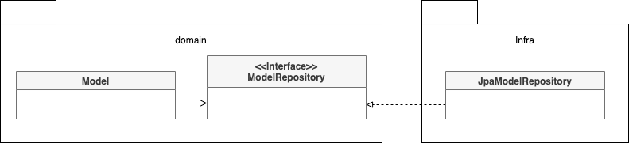

# 4.1 JPA를 이용한 리포지터리 구현

이 장의 주제는 리포지터리 구현이다. 애그리거트를 어떤 저장소에 저장하느냐에 따라 리포지터리 구현 방법이 다르기 때문에 모든 구현 기술에 대해 알아볼 수는 없다. <u>도메인 모델과 리포지터리를 구현할때 선호하는 기술을 꼽자면 <b>JPA</b></u>를 들 수 있다. 데이터 보관소로 RDBMS를 이용할때, 객체 기반의 도메인 모델과 데이터 모델 간의 매핑을 처리하는 기술로 ORM 만한 것이 없다. <u>이 절에서는 자바의 ORM 표준인 JPA를 이용해서 리포지터리와 애그리거트를 구현하는 방법에 대해 살펴본다.</u>

## 들어가기 전에

### JPA, Spring Data JPA

- JPA(Java Persistence API)
  JPA는 자바 ORM 기술에 대한 API이다. 자바 애플리케이션에서 관계형 데이터베이스를 사용하는 방식이 정의된 인터페이스이다. 쉽게 말하면 ORM 기술의 인터페이스만 모아둔 것이다. JPA 덕분에 특정 구현 기술에 대한 의존도를 줄일 수 있고, 다른 구현 기술로 쉽게 이동할 수 있다.

- Spring Data JPA
  Spring Data JPA는 Spring에서 제공하는 라이브러리 중 하나로, JPA를 추상화해서 JPA를 쉽고 편하게 쓸 수 있게 도와준다. Repository는 Spring Data JPA의 핵심으로, JPA의 추상화된 인터페이스이다. Repository 인터페이스에 정해진 규칙대로 메소드를 입력하면 Spring이 해당 메소드 이름에 적합한 쿼리를 날리는 구현체를 만들어서 Bean으로 등록해준다. JPA를 사

- Hibernate
  Hibernate는 JPA의 구현체로 ORM 프레임워크이다. JPA와 Hibernate의 관계는 interface와 interface를 구현한 class와 같다.

## 4.1.1 모듈 위치

2장에서 연급한 것처럼 리포지터리 인터페이스는 애그리거트와 같이 도메인 영역에 속하고, 리포지터리를 구현한 클래스는 인프라스트럭처 영역에 속한다. 각 타입의 패키지 구성은 아래와 같다.



팀 표준에 따라 리포지터리 구현 클래스를 domain.impl과 같은 패키지에 위치시킬 수도 있는데 이것은 리포지터리 인터페이스와 구현체를 분리하기 위한 타협안 같은 것이지 좋은 설계 원칙을 따르는 것은 아니다. 가능하면 리포지터리 구현 클래스를 인프라스트럭처 영역에 위치시켜서 인프라스트럭처에 대한 의존을 낮춰야 한다.

## 4.1.2 리포지터리 기본 기능 구현

리포지터리가 제공하는 기본 기능은 다음 두 가지다.

- ID로 애그리거트 조회하기
- 애그리거트 저장하기

```java
public interface OrderRepository {
  Order findById(OrderNo no);
  void save(Order order);
  void delete(Order order);
}
```

인터페이스는 애그리거트 루트를 기준으로 작성한다. 주문 애그리거트는 Order 루트 엔티티를 비롯해 OrderLine, Orderer, ShippingInfo 등 다양한 객체를 포함하는데, 이 구성요소 중에서 루트 엔티티인 Order를 기준으로 리포지터리 인터페이스를 작성한다.

애그리거트를 조회하는 기능의 메서드 네이밍 규칙에서 널리 쓰이는 것은 findBy프로퍼티이름 형식을 사용하는 것이다. findById는 ID에 해당하는 애그리거트가 존재하면 Order를 리턴하고 존재하지 않으면 null을 리턴한다. null을 사용하고 싶지 않다면 다음과 같이 Optional을 사용해도 된다.

```java
Optional<Order> findById(ORderNo no);
```

save 메서드는 전달받은 애그리거트를 저장한다. 이 인터페이스를 구현한 클래스는 JPA의 EntityManager를 이용해서 기능을 구현한다. 스프링 프레임워크에 기반한 리포지터리 구현 클래스는 다음과 같다.

```java
pacakge shop.order.infra;

import org.springframework.stereotype.Repository;
import shop.order.domain.Order;
import shop.order.domain.OrderNo;
import shop.order.domain.OrderRepository;

import javax.persistence.EntityManager;
import javax.persistence.PersistenceContext;

@Repository
public class JpaOrderRepository implements OrderRepository {
  @PersistenceContext
  private EntityManager entityManager;

  @Override
  public Order findById(OrderNo id) {
    return entityManager.find(ORder.class, id);
  }

  @Override
  public void save(Order order) {
    entityManager.persist(order);
  }

  // EntityManager의 remove 메서드를 이용해서 삭제 기능 구현
  @Override
  public void delete(Order order) {
    entityManager.remove(order)
  }
}
```

애그리거트를 수정한 결과를 저장소에 반영하는 메서드를 추가할 필요는 없다. <b>JPA를 사용하면 트랜잭션 범위에서 변경한 데이터를 자동으로 DB에 반영하기 때문이다.</b> 예를 들어 다음 코드를 보자.

```java
public class ChangeOrderService {
  @Transactional
  public void changeShippingInfo(OrderNo no, ShippingInfo newShippingInfo) {
    Optional<Order> orderOpt = orderRepository.findById(no);
    Order order = orderOpt.orElseThrow(() => new OrderNotFoundException());
    order.changeShipiingInfo(newShippingInfo);
  }
}
```

changeShipingInfo 메서드는 스프링 프레임워크의 트랜잭션 관리 기능을 통해 트랜잭션 범위에서 실행된다. 메서드 실행이 끝나면 트랜잭션을 커밋하는데 이때 JPA는 트랜잭션 범위에서 변경된 객체의 데이터를 DB에 반영하기 위해 UPDATE 쿼리를 실행한다. order.changeShipiingInfo 메서드를 실행한 결과로 애그리거트가 변경되면 JPA는 변경 데이터를 DB에 반영하기 위해 UPDATE 쿼리를 실행한다.

ID가 아닌 다른 조건으로 애그리거트를 조회할 때는 findBy 뒤에 조건이 되는 프로퍼티 이름을 붙인다. ID 외의 조건으로 애그리거트를 조회할 때에는 JPA의 Criteria나 JPQL을 사용할 수 있다.

```java
public interface OrderRepository {
  List<Order> findByOrdererId(String ordererId, int startRow, int size); // 한 개 이상의 Order 객체를 리턴할 수 있으므로 컬렉션 타입 중 하나인 List를 리턴 타입으로 사용
}

// JPQL을 이용한 findByORdererId 메서드 구현
@Override
public List<Order> findByOrderId(String ordererId, int startRow, int fetchSize) {
  TypedQuery<Order> query = entityManager.createQuery(
    "select o from Order o " +
        "where o.orderer.memberId.id = :ordererId",
        "order by o.number.number desc",
      Order.class);
  )
  query.setParaemter("ordererId", ordererId);
  query.setFirstResult(startRow);
  query.setMaxREsults(fetchSize);
  return query.getResultList();
}
```

# 4.2 스프링 데이터 JPA를 이용한 리포지터리 구현

앞서 언급했듯이 스프링과 JPA를 함께 적용할 때는 스프링 데이터 JPA를 사용한다. 스프링 데이터 JPA는 지정한 규칙에 맞게 리포지터리 인터페이스를 정의하면 리포지터리를 구현한 객체를 알아서 만들어 스프링 빈(Spring Bean)으로 등록해준다.
리포지터리 인터페이스를 직접 구현하지 않아도 되기 때문에 개발자는 리포지터리를 쉽게 정의할 수 있다.

> ### Spring data JPA
>
> - spring framework에서 JPA를 편리하게 사용할 수 있도록 지원하는 프로젝트
> - CRUD를 위한 공통 인터페이스 제공
> - repository 개발 시 인터페이스만 작성하면 실행 시점에 스프링 데이터 JPA가 구현객체를 동적으로 생성해서 주입

스프링 데이터 JPA는 다음 규칙에 따라 작성한 인터페이스를 찾아서 인터페이스를 구현한 스플이 빈 객체를 자동으로 등록한다.

- org.springframework.data.repository.Repository<T,ID> 인터페이스 상속
- T는 엔티티 타입을 지정하고, ID는 식별자 타입을 지정

```java
// Order Entity
@Entity
@Table(name = "purchase_order")
@Access(AccessType.FIELD)
public class Order {
  @EmbededId
  private OrderNo number; //OrderNo가 식별자 타입
}

// Order Repository
org.springframework.data.repository.Repository;

import java.util.Optional;

public interface OrderRepository extends Repository<Order, OrderNo> {
  Optional<Order> findById(OrderNo id);
  void save(Order order);
}

// Cancel Order Service
/*
스프링 데이터 JPA는 OrderRepository를 리포지터리로 인식해서 알맞게 구현한 객체를 스프링 빈으로 등록한다. OrderRepository가 필요하면 생성자에 중비해 사용
*/
@Service
public class CancelOrderService {
  private OrderREpository orderRepository;

  public CancelOrderService(OrderRepository orderRepository, _생략) {
    this.orderRepository = orderRepository;
    //...
  }

  @Transactional
  public ovid cancel(OrderNo orderNo, Canceller canceller) {
    Order order = orderRepository.findById(orderNo).orElseThrow(() => new NoOrderException());

    if(@cancelPolicy.hasCancellationPermission(order, canceller)) {
      throw new NoCancellabePermission();
    }
    order.cancel();
  }
}
```
