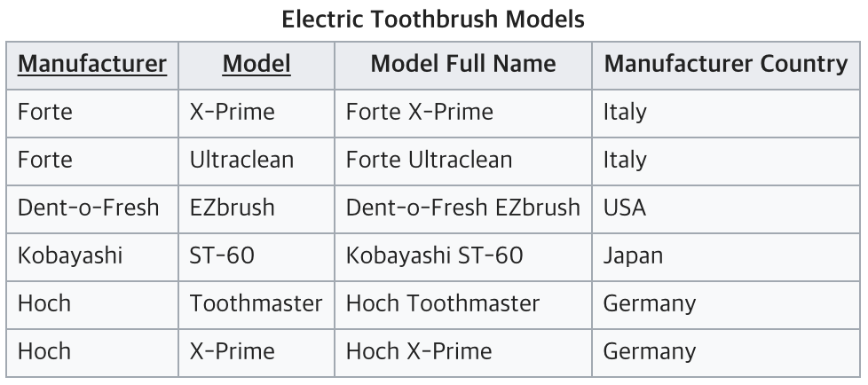
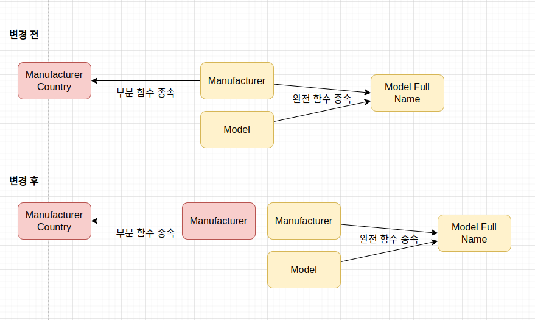
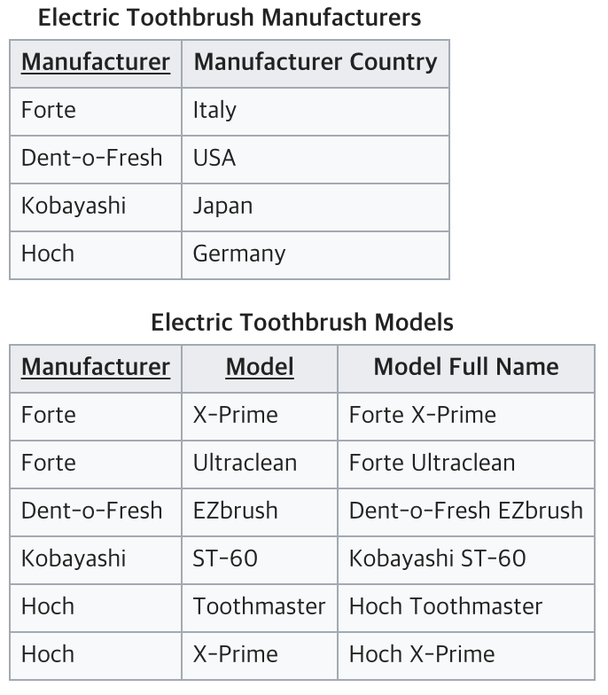
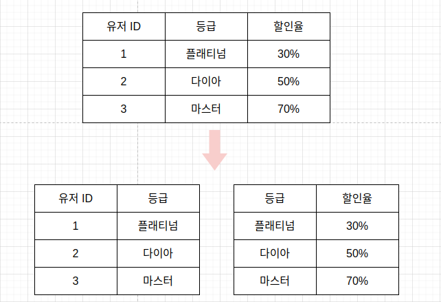

# 정규화

정규화 과정은 릴레이션 간의 <b>잘못된 종속 관계로 인해 데이터베이스 이상 현상이 일어나 이를 해결</b>하거나 <b>저장 공간을 효율적으로 사용</b>하기 위해 릴레이션을 여러개로 분리하는 과정이다. 정규화 과정은 정규형 원칙을 기반으로 정규형을 만들어가는 과정이며 정규화된 정도는 정규형(NF. Normal Form)으로 표현한다. 이 중 기본 정규형인 제 1,2,3 정규형을 살펴보자.

## 제1정규형

데이터베이스의 칼럼의 값은 더 이상 분해될 수 없는 원자값(atomic value)만으로 구성되어야 한다.

## 제2정규형

제1정규형을 만족하면서, 부분적 종속(Partial Dependency)이 없어야 한다. 부분적 종속이 없다는 것은 기본키가 아닌 모든 속성이 기본키에 완전 함수 종속적인 것을 말한다.

- 완전 함수 종속

  - X에 따라 Y가 결정될때 X -> Y로 표현하는데, 이때, Y는 X에 함수 종속이라고 한다. 예를 들어, 유저아이디를 알면 유저이름을 알 수 있는데, 이때, 유저아이디가 X가 되고, 유저이름이 Y가 된다. 이때 X를 결정자라고 하고, Y는 종속자라고 한다.

- 함수 종속에서 X값이 여러개일 경우
  - {X1, X2} -> Y일 경우, X1, X2가 Y를 결정할때, 이를 완전 함수 종속이라고 하고, X1, X2 중 하나만 Y값을 결정할때 이를 부분 함수 종속 (부분적 종속)이라고 한다. 2NF에서는 이러한 부분적 종속을 제거한다.

 

위의 예시에서 Model과 Manufacturer는 Model full name 필드를 결정한다. 하지만 Model과 Manufacturer는 Manufacturer Country와 아무런 연관이 없고, 결정하지 않는다. Manufacturer Country를 결정하는 건 Manufacturer이다.

따라서 다음과 같이 관계를 변경할 수 있다.

 

## 제3정규형

제3정규형이고 기본키가 아닌 모든 속성이 이행적 함수 종속(transitive FD)을 만족하지 않는 상태를 말한다.

이행적 함수 종속이란, A->B, B->C이면 논리적으로 A-C가 성립하는데, 이때 집합 C가 집합 A에 이행적으로 함수 종속 되었다고 한다.

유저 아이디를 알면 등급을 알 수 있고, 등급을 알면 할인율을 알 수 있다. 따라서 아래와 같이 두개의 테이블로 분리할 수 있다.

> reference

- <a href="https://stackoverflow.com/questions/47647139/database-design-separate-tables-vs-one-table-for-select-queries">Separate tables vs one table for select queries</a>

- <a href="https://en.wikipedia.org/wiki/Second_normal_form">wikipedia</a>
