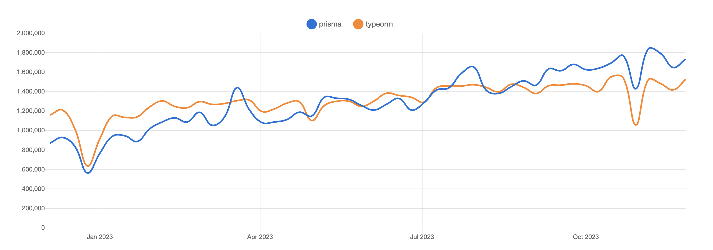

# Typeorm vs Prisma

새롭게 시작하는 사이드 프로젝트에서 사용할 ORM으로 어떤 것이 적절할지 고민하다가 Typeorm과 Prisma를 비교해보았다.



## Typeorm 

  TypeORM은 테이블을 모델 클래스에 매핑하는 ORM(Object Relational Mapping)이다. 이러한 모델 클래스는 SQL 마이그레이션을 생성하는 데 사용될 수 있다. 모델 클래스의 인스턴스는 런타임 시 애플리케이션에 대한 CRUD 쿼리용 인터페이스를 제공한다.

  Typeorm은 이름에서 알 수 있듯이 Typescript로 개발된 ORM이고, 가장 큰 장점이라고 한다면, <b><u>타입의 안정성을 보장한다</u></b>는 것이다. 

### 장점

- 타입 선언과 엔티티 정의

  아래 예시 코드는 User 모델을 정의한 코드이다. 각 필드마다 타입이 지정되어 있으므로 타입스크립트에서 타입을 추론할 수 있다.

  ```js
  @Entity()
  class User {
      @PrimaryGeneratedColumn()
      id: number;

      @Column()
      name: string;

      @Column()
      email: string;
  }
  ```

- 타입 안전한 쿼리 빌더 및 메서드

  TypeORM은 타입 안정성을 고려하여 쿼리를 작성하는 동안 TypeScript의 타입 추론을 지원한다. 이는 잘못된 쿼리나 타입 불일치를 컴파일 시간에 잡아낼 수 있다.

  ```js
  const userRepository = connection.getRepository(User);
  const user = await userRepository.findOne({ where: { id: 1 } });  // TypeScript는 user가 User 타입이라고 추론하여 안전성을 제공
  ```

### 예외 

하지만 Typeorm을 실제로 사용하다 보면 타입 안정성을 보장하지 못하는 경우가 있다. 예를 들어, 아래 코드는 타입스크립트에서는 에러가 발생하지 않지만, 실제로 실행하면 에러가 발생한다.

- select로 특정 필드만 조회할 때

    ```js
    const postRepository = getManager().getRepository(Post)
    const publishedPosts: Post[] = await postRepository.find({
      where: { published: true },
      select: ['id', 'title'],
    })

    const post = publishedPosts[0]

    // The TypeScript compiler has no issue with this
    if (post.content.length > 0) {
      console.log(`This post has some content.`)
    }
    ```

    publishedPosts에는 select로 id와 title만 조회해온 데이터로 content 필드가 없음에도, 타입스크립트 컴파일러에서는 content 필드에 접근하려고 할때 에러를 잡아내지 못한다. 그리고 런타임에서 아래와 같은 에러가 발생할 것이다.

    `TypeError: Cannot read property "length" of undefined`

- join해서 데이터를 가져올 때

  Typeorm은 relations 옵션을 통해 두 엔티티를 조인해서 eager loading할 수 있다. select에서 필드를 선택할때 자동완성이 되는 것과 다르게, relations의 경우, 자동완성이 되지 않는다. 그래서 아래의 코드에서처럼 오타가 발생하더라도 타입스크립트 컴파일러에서 에러를 잡아내지 못한다.

  ```js
  const postRepository = getManager().getRepository(Post)
  const publishedPosts: Post[] = await postRepository.find({
    where: { published: true },
    relations: ['author'],
  })

  const publishedPosts: Post[] = await postRepository.find({
  where: { published: true },
  // this query would lead to a runtime error because of a typo
  relations: ['authors'],
  })  
  ```

  그래서 결국 아래와 같은 런타임 에러가 발생한다.

    `UnhandledPromiseRejectionWarning: Error: Relation "authors" was not found; please check if it is correct and really exists in your entity.`


## Prisma

  Prisma는 ORM의 문제점을 해결하기 위해 만들어진 새로운 종류의 ORM이다. Prisma는 불필요한 모델 인스턴스, 비즈니스 로직과 스토리지 로직의 혼합, 타입 안정성 부족 또는 lazy loading으로 인해 예측할 수 없는 쿼리와 같은 전통적인 ORM의 많은 문제점을 완화한다.

  Prisma는 모델 클래스를 정의하지 않고, prisma 스키마를 사용해 모델을 정의한다. Typeorm과 마찬가지로 SQL 마이그레이션을 생성 및 적용할 수 있고, Nodejs와 타입스크립트에서 사용할 수 있는 타입 안정성이 보장된 prisma client를 사용해 CRUD 쿼리를 실행할 수 있다.

### 특징

  공식문서에 따르면, Prisma는 Typeorm과 비교했을때, 추상화 레벨에 차이가 있다고 한다. Typeorm이 SQL을 미러링한 것이 가깝다면, Prisma는 prisma client를 쿼리를 실행하는 고수준의 추상화를 제공한다.

  - 직관적인 string 필터링이 가능하다. (contains, startsWith, endsWith 등)

    ```js
    // Ex1
      // Typeorm
      const posts = await postRepository.find({
      where: {
        title: ILike('Hello World'), // ILike는 Typeorm에서 제공하는 operator
      },
      })

      // Prisma
      const posts = await prisma.post.findMany({
      where: {
        title: 'Hello World',
      },
      })
    // Ex2
      // Typeorm
      const posts = await postRepository.find({
      where: {
        title: ILike('%Hello World%'),
      },
      })
      // Prisma
      const posts = await prisma.post.findMany({
      where: {
        title: { contains: 'Hello World' },
      },
      })
    ```

  - 관계 설정이 간편하다.

    Prisma의 가상 관계 필드는 직관적이고 간편한 방법으로 관계가 설정된 데이터를 다룰 수 있게 한다. 이는 관계 탐색, 중첩쓰기, 필터링 등을 효율적으로 할 수 있게 해준다. 아래 예시 코드를 보면, Typeorm보다 직관적으로 데이터를 다룰 수 있는 것 같다.

    ```js
    // 중첩 쓰기
    const newUser = await prisma.user.create({
      data: {
        name: 'John',
        posts: {
          create: [{ title: 'Post 1' }, { title: 'Post 2' }],
        },
      },
      include: { posts: true },
    });

    console.log(newUser); // 새로운 사용자와 연결된 포스트들을 확인

    // 필터링
    const usersWithSpecificPosts = await prisma.user.findMany({
    where: {
      posts: {
        some: { title: { contains: 'Prisma' } },
      },
    },
    });
     console.log(usersWithSpecificPosts); // Prisma와 관련된 포스트를 가진 사용자들을 가져옴            
    ```
     
  - 타입 안정성을 보장한다.

  아래의 예시코드들은 Typeorm을 사용했을때, 컴파일러에서 잡아내지 못해 런타임에 발생하는 에러이다. 하지만 Prisma는 타입 안정성을 확실하게 보장함으로써 이러한 에러들을 컴파일러에서 잡아낸다. 

  ```js
  // join 시에 발생할 수 있는 오타에 의한 런타임 에러 방지
  const publishedPosts = await prisma.post.findMany({
    where: { published: true },
    include: { author: true }, // author will be autocompleted
  })
  // findMany의 결과로 publishedPosts의 타입이 동적으로 생성된다.  
  const publishedPosts: (Post & {
  author: User
  })[]  

  // operator에 맞지 않는 type 사용에 의한 런타임 에러 방지 
  const publishedPosts = await prisma.post.findMany({
  where: {
    published: true,
    title: { contains: 'Hello World' },
    views: { gt: 'test' }, // Caught by the TypeScript compiler
  },
  })  

  // 존재하지 않는 칼럼을 선택할 경우 런타임 에러 방지 
  const publishedPosts = await prisma.post.findMany({
  where: {
    published: true,
    title: { contains: 'Hello World' },
    viewCount: { gt: 0 }, // Caught by the TypeScript compiler
  },
  })

  // 필수값을 입력하지 않았을 경우 런타임 에러 방지
  const newUser = await prisma.user.create({
  data: {
    name: 'Alice', // Caught by the TypeScript compiler
  },
  })
  [ERROR] 10:39:07 ⨯ Unable to compile TypeScript:
  src/index.ts:39:5 - error TS2741: Property 'email' is missing in type '{ name: string; }' but required in type 'UserCreateInput'.
  ```

## 결론

Typeorm을 사용하면서 특정 필드만 select하거나 join해서 데이터를 가져올 때에는 새로운 타입을 만들어 명시적으로 타입을 지정해주었다. 이런 케이스가 늘어날 수록 매번 타입을 지정해주는 것이 번거로워졌다. 타입 안정성을 보장하지 못하는 경우가 늘어날 수록 Typeorm을 사용하는 의미가 없어진다고 생각이 들었다. 

그래서 새로운 orm을 찾아보다가 prisma와 비교를 해보았는데, prisma는 타입 안정성을 보장하고, 직관적인 쿼리를 작성할 수 있어서 Typeorm보다 더 편리하게 사용할 수 있을 것 같다. npm 트랜드를 확인해보니 prisma의 다운로드 수가 typeorm을 넘어선 것을 확인할 수 있었는데, 이미 많은 유저들이 prisma로 넘어간 것 같다.

Prisma를 직접 사용해보면서 더 많은 장점을 찾아보고, 실제로 사용해보면서 느낀 장단점을 정리해보면 좋을 것 같다.

> reference

- <a href="https://www.prisma.io/docs/orm/more/comparisons/prisma-and-typeorm">Comparing prisma</a>