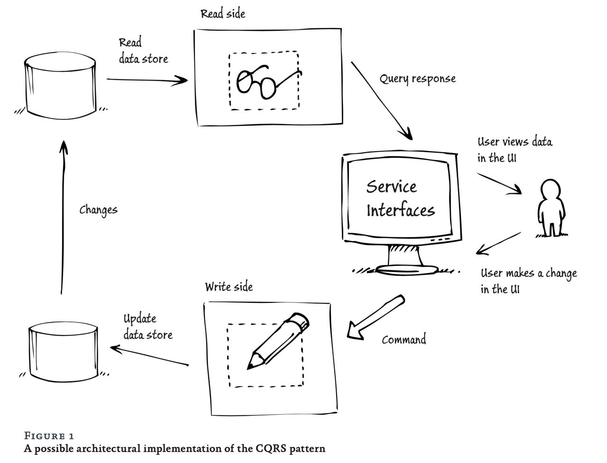

# CQRS (Command Query Responsibility Segregation)

CQRS의 시작은 도메인이고, 도메인이 변경되는 비즈니스 로직이 포함되는 command와 도메인의 상태를 조회하는 query로 구분시켜 각각의 책임을 분리하는 것이다. 각 작업에 최적화된 데이터 저장소를 사용해 확장성과 성능을 높이는 것이 목적이다. 예를 들어, Command와 Query를 분리해 하나의 유즈케이스 별 책임을 분리해 코드를 작성하고, 읽기 작업에는 NoSQL 데이터베이스를 사용하고, 쓰기 작업에는 SQL 데이터베이스를 사용하는 등 필요에 따라 다양한 데이터 저장소를 선택해 사용할 수 있다.

## 장점

- 하나의 유즈케이스에서 하나의 책임을 갖게 되므로 유즈케이스가 단순하게 구분되고, 가독성이 높아진다.

- 데이터 소스의 독립적인 자원 관리가 가능하다.
  읽기와 쓰기에 대한 데이터 소스 (DB)를 분리해서 관리할 수 있다. 보통 쓰기:읽기 비율은 1:1000이라고 한다. 그렇다면, 적게 발생하는 쓰기에 대한 DB 인스턴스는 작게 관리하고, 많이 발생하는 읽기에 대한 DB 인스턴스는 크게 관리할 수 있다.

- 성능 향상
  읽기와 쓰기에 대한 데이터 소스를 분리하므로, 쓰기로 인해 DB가 lock되는 경우가 없어지고, 읽기에 대한 DB 인스턴스를 복제해 읽기 성능을 향상시킬 수 있다. 조회 DB로는 주로 NoSQL을 사용하고, join을 최소화하므로 더 빠르게 데이터를 조회할 수 있다.

## 단점

- 구현이 복잡하다.
  하나의 유즈케이스를 Command와 Query로 분리하고, 각각의 책임을 분리해야 하므로 구현이 복잡해진다.

- 데이터의 일관성이 떨어진다.
  Command와 Query가 분리되어 있으므로, 데이터의 일관성이 떨어질 수 있다. command 성공으로 변경된 데이터가 query에 반영되지 않을 수 있다. 

> reference

- <a href="https://wonit.tistory.com/628">CQRS 패턴에 대한 오해 풀기</a>
- <a href="https://jaimemin.tistory.com/2203#google_vignette">CQRS 패턴과 실제 적용 사례</a>
- <a href="https://www.youtube.com/watch?v=fg5xbs59Lro&ab_channel=%EC%9A%B0%EC%95%84%ED%95%9CTech">B마트 전시 도메인 CQRS 적용하기</a>